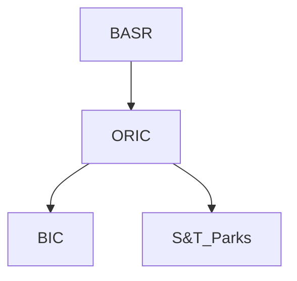

SZABIST UNIVERSITY
Islamabad Campus

PEOPLE
make the
EXPERIENCE

# Student HANDBOOK 2023-24

We see a
LEADER
in you

*Discover Yourself*
---
# WE CELEBRATE
# DIVERSITY
---
# SZABIST UNIVERSITY

## Student Handbook 2023

### Islamabad Campus

SZABIST UNIVERSITY ISLAMABAD CAMPUS
Street # 09, Plot # 67, Sector H-8/4, Islamabad - Phone: 051-4863363-65 - www.szabist-isb.edu.pk
---
# Contents

Welcome Message by the Chancellor
Welcome Message by the President
Welcome Message by the Vice President (Academics)
Welcome Message by the Vice President (Development & Finance)
Welcome Message by the Vice President (Administration)
Welcome Message by Head of Campus (Islamabad)

| Item | Page |
|------|------|
| SZABIST Campus Location Map (Islamabad) | viii |
| List of Abbreviations and Acronyms | 1 |
| Program Management and Communication | 2 |

## 1. ACADEMIC GUIDELINES

| Section | Title | Page |
|---------|-------|------|
| 1.1. | Rules Governing Registration and Classes | 10 |
| 1.2. | Rules Governing Payment of Fees | 12 |
| 1.3. | Rules Governing Attendance | 13 |
| 1.4. | Rules Governing Withdrawal from Courses | 14 |
| 1.5. | Rules Governing Grading | 16 |
| 1.6. | Rules Governing Examinations | 18 |
| 1.7. | Rules Governing Research Project, IRS, Thesis and Dissertation | 25 |
| 1.8. | Rules Governing Academic Integrity, Plagiarism and Similarity Index | 26 |
| 1.9. | Rules Governing Transfer | 27 |
| 1.10. | Rules Governing Cancellation of Provisional Admission, Probation, Dismissal & Re-admission | 30 |
| 1.11. | Rules Governing Provisional Transcripts, Degree Completion and Continuation for Higher Degrees | 34 |
| 1.12. | Rules Governing Convocation Medals and Honors Roll List | 37 |
| 1.13. | Review and Revision of Academic Policies | 39 |
---
# Contents

## 2. STUDENT FACILITATION

2.1. Rules Governing Libraries                                                            41

2.2. Rules Governing Computer Labs                                                        43

2.3. Rules Governing Media Cage, Studio, Sound and Media Labs, and iMac Suite             47

2.4. Radio Rules ZAB-FM 106.6                                                             49

2.5. Rules Governing Financial Assistance                                                 52

2.6. Rules Governing Student Career Services & Alumni Relation                            54

2.7. Rules Governing Student Activities and Associations                                  56

2.8. Rules Governing Students Code of Conduct                                             58

2.9. Wellness Clinic                                                                      65

2.10. Other Facilities: Photocopy & Printing Shop, Cafeteria and Car Parking              66

3.0. Institutional Research Quality Enhancement Cell                                      67

Annexure-A: List of Forms                                                                 69

Annexure-B: List of Registration Charges, Fines, and Penalties                            71

Annexure-C: Office of Research, Innovation and Commercialization (ORIC)                   72
---
# Welcome Message by the Chancellor

Based on the vision articulated by Shaheed Zulfikar Ali Bhutto of a self-reliant Pakistan, SZABIST University was established in 1995 to offer a path to high quality education, knowledge, research and holistic development.

Keeping in view the standards of tertiary education and market requirements, SZABIST University pays special attention to grooming students as industry's future leaders and offers degrees in the disciplines of Management Sciences, Computing and Engineering Sciences, Media Sciences, Social Sciences, Law, Public Health, Biosciences and Education Leadership Management.

Taking forward the mission of our Founding Chancellor, Shaheed Mohtarma Benazir Bhutto, SZABIST University has come a long way and is today recognized as one of the best business schools in the country by the Higher Education Commission (HEC) of Pakistan. SZABIST University is also rated as an "Outstanding" institution by the Charter Inspection and Evaluation Committee (CIEC), Government of Sindh.

SZABIST University offers a nurturing environment where students can advance not only their capabilities and strengths to achieve their educational, professional and personal aspirations but also develop their interests and engage in a range of exciting co-curricular and extra curricular activities by joining clubs and societies.

This Handbook is designed to help you, the students, to familiarize you with SZABIST University's policies and procedures, to make your experience as a student both rewarding and successful.

I congratulate you on your decision to become a part of SZABIST University and I welcome you on a journey enriched with learning and discovery.

Dr. Azra Fazal Pechuho
Chancellor
SZABIST University
---
# Welcome Message by the President

It gives me immense pleasure to welcome you to the Shaheed Zulfikar Ali Bhutto Institute of Science and Technology University. Over the past many years SZABIST University has made remarkable progress in strengthening our market reputation nationally and internationally. This is evident from the increased enrollment in our six campuses (Karachi, Larkana, Hyderabad, Islamabad, Gharo and Dubai), expansion in the academic programs and high quality credentials . The recent addition of our Gharo Campus has extended our outreach to several districts in lower Sindh.

At SZABIST University, we provide students with market relevant and skill-based education, enabling them to become responsible citizens and simultaneously productive members of Pakistan's society and economy.

SZABIST University maintains a high standard of education; we place a priority on highly qualified faculty and professionals who provide a rigorous and conducive and supportive learning environment. In addition to a wide spectrum of disciplines, exciting opportunities for co-curricular activities are also available. Student Societies organize a range of sports, arts, music, debate, drama and other activities. Guest speaker sessions, workshops and networking with our Alumni and renowned companies for assistance in job placements are also part of a student's life at SZABIST University.

Education at SZABIST University is one of the best investments for a successful professional career. We encourage our students to work hard and strive for excellence in every aspect of their academic career.

I would like to welcome all our students to the Academic year 2023-24 at SZABIST University.

Shahnaz Wazir Ali  
President  
SZABIST University
---
# Welcome Message by the Vice President Academics

A great leader Mr. Nelson Mandela said: "Education is the most powerful weapon which you can use to change the world."

SZABIST University has seen exponential growth in its programs, students, and physical infrastructure since its inception in 1995. This could be possible with the full support of its Management, especially of its worthy Chancellor, Dr. Azra Fazal Pechuho.

The whole purpose of education is to create "Analytical Minds". As a responsible institution, we just don't believe in classroom studies but believe in complete personality development. Our various students' societies are quite active, the purpose of which is to provide the students a platform to lead and learn to be a great team player by giving them opportunities to arrange different curricular and extra-curricular activities, which makes them good leaders globally competitive, morally upright, and well-rounded, disciplined individuals.

We at SZABIST University call our students our "Products" not our "customers" as we run our institution professionally not pure commercially. To facilitate the students getting internships, scholarships, and job placement, we have proper departments that regularly invite leading companies and students for "Recruitment Drives". We also periodically organize "Job Fairs" at our campus. Due to these efforts put in by our highly professional Faculty, 90% of graduates manage to get jobs within the first three months of their graduations.

SZABIST University now has six campuses in Karachi, Islamabad, Larkana, Hyderabad, Gharo, and Dubai. SZABIST University is the only Pakistani institution having its campus in Dubai International Academic City since 2003, competing with the world's leading institutions. Karachi campus is the mother campus having more than 8000 students enrolled in its 40-plus academic programs in Management Sciences, Computer Science, Social Sciences, Media Science, Life Sciences, Education, Mechatronic Engineering, and Law. Our three-year LLB program is offered in collaboration with the University of London.

SZABIST University programs comply with HEC recommended course plans and are accredited by regulatory bodies such as NBEAC, NCEAC, PEC, NACTE, and CIEC. The learning outcomes of the programs ensure to create critical & creative thinking, acquire problem-solving skills, and professionally handle all pedagogical tools. We are fully aware that a University without Research is like a "Body" without a "Soul"; therefore, we emphasize research activities at all levels of our programs.

Finally, I thank all the newcomers for choosing SZABIST University for their academic pursuits and wish them a happy stay during the entire period of their course of studies. I expect, as SZABISTian, you will show a high level of maturity through your conduct and actions.

Prof. Dr. Mohammad Altaf Mukati
Vice President (Academics)
SZABIST University
---
# Welcome Message by the Vice President Development & Finance

We are delighted to welcome you to the SZABIST University. Whatever your discipline, we work towards producing highly qualified professionals to meet national and global contemporary needs.

As a SZABIST University student, you are part of a very special collaborative community. Our students are enthusiastic and caring colleagues; our Alumni are at national and multinational organizations and help in providing the networks required to succeed in life. Our Student Support Services conducts round the year extracurricular activities. Our faculty comprises of the most talented teachers, researchers and scholars-they are accessible, committed and passionate about their work. Our staff members are efficient and work hard to provide all the support needed- they listen to you and welcome ideas to make changes to suit your needs.

SZABIST University prepares you for leadership roles giving you the knowledge and skills and at the same time promotes ethics and values and believes in treating people with courtesy, dignity and respect.

Welcome to the university, wishing you a rewarding time.

Nasreen Haque
Vice President (Development And Finance)
SZABIST University
---
# WELCOME Message by Vice President Administration

I am delighted to welcome you to Shaheed Zulfikar Ali Bhutto Institute of Science and Technology. At SZABIST University, you will become part of a strong and supportive community that values academic excellence and diversity.

The unfailing dedication and vision of Shaheed Mohtarma Benazir Bhutto has led SZABIST University to grow into an exceptionally well established Institution.

SZABIST University provides an opportunity to students not just to acquire quality education but also to establish their future in obtaining jobs at renowned national and international organizations. Today, many graduates of SZABIST University, have successfully secured good positions in most of the multinational firms known around the world, succeeding in their own businesses, in influential international and non-governmental organizations.

We hope and encourage you as well, to make a mark for yourself and we are certain that you too will scale the heights of success and overcome challenges of the new era.

We also encourage our students to promote a campus environment that is respectful, supportive and safe.

It is hoped that the Student Handbook 2023 will serve as a useful guide in planning out your academic journey.

I hope each of you have a fruitful learning experience here at SZABIST University.

Imtiaz Kazi  
Vice President Administration  
SZABIST University
---
# Welcome Message by Head of Campus

Welcome to SZABIST University Islamabad Campus one of the leading seats of higher learning!

SZABIST University remains the first choice for students hailing from socio-economically diverse cadres of society while ensuring all standards of educational process, we remain an equal opportunity contributor in higher education. Our motto of quality education at affordable cost bespeaks our values. Such a visionary approach affords SZABIST University an edge over other educational institutions of the sort.

Following a dual track of education where personality development and character building go hand in hand with academic excellence, the institute has developed an appropriate environment spearheaded by its distinguished faculty, capable management, and talented students—all being conscious of their coordinated role as equal stakeholders in the entire educational process.

In addition to excelling in academic standards, students' active participation in socio-cultural activities of high canons nurture exceptional values of social importance and imbibe a high sense of social and civic responsibility among the youth.

We welcome you to present a united Pakistani community of students, engaged in a ceaseless endeavour to set competitive educational standards and seek unprecedented horizons in higher education to stimulate and lead the industrial transformation of the country.

This Handbook provides you with comprehensive information about rules and regulations followed at SZABIST University. We hope that as part of SZABIST University community you will find your stay here self-fulfilling and productive.

Khusro Pervaiz Khan
Head of Campus
SZABIST University
Islamabad Campus
---
# Preface

This edition of the Student Handbook has been compiled to communicate to you rules, policies, and procedures governing the student body, and also to describe the services available to you as a student. For your convenience, a copy of the handbook is maintained on SZABIST University website - www.szabist-isb.edu.pk. While going through the Student Handbook 2023, you will be able to identify the system design including key departments, their functions, and the personnel who will assist you throughout your association with SZABIST University. In case you require any clarifications, do contact your Program Manager and Student Advisor who have been appointed to support you. Their contact details are on page 6.

We hope to see you and have a successful educational experience at SZABIST University.

| Contact Information |
|----------------------|
| 051-4863363-65 |
| info@szabist-isb.edu.pk |
| www.szabist-isb.edu.pk |
| www.facebook.com/SZABIST.Islamabad.Official |
---
# SZABIST University Location Map
## (Islamabad Campus)

![Map of SZABIST University Islamabad Campus]

The map shows the location of SZABIST University's Islamabad Campus and its surrounding area. Key features of the map include:

1. A red marker indicating the location of Shaheed Zulfikar Ali Bhutto Institute of Science and Technology (SZABIST)
2. A blue arrow pointing towards the campus
3. Various landmarks and institutions in the vicinity:
   - Pakistan Meteorological Department
   - Beaconhouse Margalla Campus
   - Islamabad Convent School
   - Pakistan Flag Monument Park
   - Islamabad Model Commerce College
   - The City School Capital Campus
   - Pak Turk National School
   - COMSATS
   - Shifa International Hospitals Ltd
   - Shifa College of Medicine
   - Federal Board of Intermediate and Secondary Education
   - Federal Park
   - Filtration Plant
   - F-8/3 Park
   - Mir Chakar Khan Rind Park

4. Major roads and streets:
   - Faiz Ahmed Faiz Road
   - Faisal Avenue
   - Various numbered streets (Street 3, Street 4, Street 8, Street 9, etc.)
   - Service roads (Service Rd 5, etc.)

5. A river or water body running through the area

The map is sourced from Google Maps, as indicated by the Google logo in the bottom right corner.

At the bottom of the image, there's a footer with:
- An icon and text reading "Student Handbook 2023"
- A Roman numeral "VIII" in the bottom right corner
---
# List of Abbreviations and Acronyms

| Abbreviation | Full Form |
|--------------|-----------|
| AC | Academic Council |
| ASO | Academic Support Office |
| BASR | Board of Advanced Studies and Research |
| BBA | Bachelor of Business Administration |
| BoS | Board of Studies |
| BoF | Board of Faculty |
| BS (Accounting & Finance) | Bachelor of Science in Accounting & Finance |
| BS (Computing Science) | Bachelor of Sciences in Computing |
| BS (Software Engineering) | Bachelor of Sciences in Software Engineering |
| BS (Artificial Intelligence) | Bachelor of Sciences Artificial Intelligence |
| BS (Media Sciences) | Bachelor of Sciences in Media Sciences |
| BS (Social Sciences) | Bachelor of Sciences in Social Sciences |
| CGPA | Cumulative Grade Point Average |
| DC | Doctoral Committee |
| DC Case | Disciplinary Committee Case |
| EDC | Executive Development Center |
| EMBA | Executive Master of Business Administration |
| ERFA | External Relations and Financial Assistance |
| GPA | Grade Point Average |
| HEC | Higher Education Commission |
| HoD | Head of Department |
| IRS | Independent Research Study |
| JISR | Journal of Independent Studies and Research |
| MBA | Master of Business Administration |
| MMS | Master of Media Science |
| MHRM | Master in Human Resource Management |
| MPM | Master in Project Management |
| MS (Computer Science) | Master of Sciences in Computer Science |
| MS (Data Science) | Master of Sciences in Data Science |
| MS (Development Studies) | Master of Sciences in Development Studies |
| MS (Management Sciences) | Master of Sciences in Management Sciences |
| MS (Project Management) | Master of Sciences in Project Management |
| MS (Social Sciences) | Master of Sciences in Social Sciences |
| MS (Clinical Psychology) | Master of Sciences in Clinical Psychology |
| NRC | National Research Conference |
| PM | Program Manager |
| PMBA | Professional MBA |
| Ph.D | Doctor of Philosophy |
| PSO | Program Support Officer |
| RC | Research Committee |
| SA | Student Adviser |
| ORIC | OFFICE OF RESEARCH, INNOVATION & COMMERCIALIZATION |
---
# Program Management and Communication

## Program Orientation

Program Orientation for new students is organised on the first day of academic session, where Head of Department/Program Managers offer briefing on academic rules and regulations, fee and scholarships, grading and assessments, and use of facilities.

## Program Management

SZABIST University has a unique system for mentoring and counseling of students through Program Managers. The relevant Program Manager is the first point of contact for all students for timely support in matters related to academic supervision and career counseling.

## Communication

Please note that urgent announcements will be conspicuously posted on notice boards. Furthermore, to ensure prompt dissemination of important information, SMS are sent to students on their cell phones. To remain fully informed, all SZABIST University students are strongly encouraged to regularly check the bulletin boards, SZABIST University website, and ZABDESK for important announcements. Please note that urgent announcements will be conspicuously posted on notice boards. Furthermore, to ensure prompt dissemination of important information, SMS are sent to students on their cell phones. To remain fully informed, all SZABIST University students are strongly encouraged to regularly check the bulletin boards, SZABIST University website, and ZABDESK for important announcements.

## Applications

All student applications, properly documented, are to be emailed to the relevant Program Manager/Head of Department and/or relevant section head. These applications are updated in students' files along with the decisions taken.

## Student Letters

Following Departments are allowed to issue different letters to students and alumni on request, subject to necessary documentation/approvals:

| Department | Types of Letters |
|------------|------------------|
| EDC | Report/Project Reference, Internship Reference Letter, Sponsorship letters |
| Admissions | Admission Offer Letter |
| Records | Migration and Degree Completion Letters, Provisional Transcript, Bona-fide Student Letter, Visa Support Letter, English Language as Medium of Instruction Degree Verification and Attestation |
| Academics | Probation Letter, Dismissal Letter, MS/PhD Thesis and Dissertation related Letters |
| External Relations | Scholarship Letter |
| Program Manager | Student Reference Letters, Character Certificate, Appreciation Letters for Guest Speakers |
---
# Faculty of Management Sciences

| Name | Position | Email |
|------|----------|-------|
| Dr. Muhammad Asif Khan | Professor / Associate Dean / Program Manager PhD. MS | dr.asif@szabist-isb.edu.pk |
| Dr. Shazia Akhtar | Professor / Head of Department / Program Manager MBA-Day/Evening | dr.shazia@szabist-isb.edu.pk |
| Dr. Muhammad Zeb Khan | Professor / Program Manager MS (PM) | dr.zeb@szabist-isb.edu.pk |
| Dr. Saqib Mahmood | Assistant Professor / Program Manager MS- Business Analytics | dr.saqib@szabist-isb.edu.pk |
| Dr. Muhammad Saeed Shahbaz | Assistant Professor / Program Manager MS- Management Sciences | dr.saeed@szabist-isb.edu.pk |
| Dr. Muhammad Shafiq | Assistant Professor / Program Manager EMBA/PMBA & MHRM | dr.shafiq@szabist-isb.edu.pk |
| Dr. Fuwad Bashir | Associate Professor / Program Manager MPM | dr.fuwad@szabist-isb.edu.pk |
| Dr. Shumaila Zeb | Associate Professor / Program Manager BBA | dr.shumaila@szabist-isb.edu.pk |
| Dr. Hassan Raza | Associate Professor / Program Manager (BS AF) | dr.hassan@szaabist-isb.edu.pk |
---
# Faculty of Computing and Engineering Sciences

| Name | Position | Email |
|------|----------|-------|
| Dr. Muhammad Usman | Professor/Associate Dean / Program Manager PhD (Computer Sciences) | dr.usman@szabist-isb.edu.pk |
| Dr. Tazeen Athar | Assistant Professor / Head of Department (Computer Sciences) | dr.tazeen@szabist-isb.edu.pk |
| Dr. Shahzad Latif | Assistant Professor / Program Manager BS (CS) (1st & 2nd Year) | dr.shahzad@szabist-isb.edu.pk |
| Dr. Fadia Shah | Assistant Professor (BSCS 3rd & 4th Year) | dr.fadia@szabist-isb.edu.pk |
| Dr. Danish Mehmood | Assistant Professor / Program Manager MSCS/MS (Cyber Security) | dr.danish@szabist-isb.edu.pk |
| Muhammad Usman Ali | Lecturer / Program Manger BS (SE) (1st & 2nd Year) | usman.ali@szabist-isb.edu.pk |
| Mr. Babar Jehangir | Lecturer / Program Manager BS (SE) (3rd & 4th Year) | babar.jehangir@szabist-isb.edu.pk |
| Dr. Muhammad Imran | Associate Professor / Head of Department Robotics and Artificial Intelligence Program Manager (MS-Data Sciences) | dr.imran@szabist-isb.edu.pk |
| Mr. Aizaz Raziq | Lecturer / Program Manager BS (AI) | aizaz.raziq@szabist-isb.edu.pk |
---
# Faculty of Social Sciences

| Name | Position | Email |
|------|----------|-------|
| Dr. Taraq Waheed | Assistant Professor / Head of Department | taraq.waheed@szabist-isb.edu.pk |
| Ms. Aliya Abdul Hayee | Assistant Professor / Program Manager MS (Clinical Psychology) | aliya.abdulhayee@szabist-isb.edu.pk |
| Dr. M. Abo Ul Hassan Rashid | Assistant Professor / Program Manager MS (SS) & MS (Sociology) | hassan.rashid@szabist-isb.edu.pk |
| Dr. Abdul Razzaq Khan | Assistant Professor / Program Manager MS (DS) | dr.razzaq@szabist-isb.edu.pk |
| Ms. Sana Mukhtar | Lecturer / Program Manager BS (SS) | sana@szabist-isb.edu.pk |

# Faculty of Media Sciences

| Name | Position | Email |
|------|----------|-------|
| Dr. Wajid Zulqarnain | Associate Professor / Head of Department - Media Sciences Program Manager (Master of Media Sciences) | dr.wajid@szabist-isb.edu.pk |
| Dr. Naveed Ullah Hashmi | Assistant Professor Program Manager (Bachelor of Media Sciences) | naveed.hashmi@szabist-isb.edu.pk |
---
## Student Advisor (Location: First Floor, Admin Block)

| Name | Designation & Email | Extension |
|------|---------------------|-----------|
| Mr. Zeeshan Hamid | Lecturer / Student Advisor zeeshan.hamid@szabist-isb.edu.pk | Ext # 565 |

## Psychologist (Location: 2nd Floor, Admin Block)

| Name | Designation & Email | Extension |
|------|---------------------|-----------|
| Dr. Abdur Rahid | Assistant Professor/Psychologist drrahid@szabist-isb.edu.pk | Ext # 483 |
| Dr. Syeda Razia Bukhari | Assistant Professor/Psychologist drrazia@szabist-isb.edu.pk | Ext # 468 |

## Program Support Officers (Location: First Floor, Academic Block)

| Name | Designation & Email | Extension |
|------|---------------------|-----------|
| Mr. M. Aqeel Ahmed | Program Support Officer (Management Sciences) aqeel.ahmed@szabist-isb.edu.pk | Ext # 201 |
| Mr. Syed Haris Azam | Program Support Office (Computer Sciences) haris.azam@szabist-isb.edu.pk | Ext # 201 |
| Ms. Fatima Bashir | Program Support Office (Media Sciences) fatima.bashir@szabist-isb.edu.pk | Ext # 236 |
| Ms. Khajida Khawaja | Program Support Office (Social Sciences) khajida.khawaja@szabist-isb.edu.pk | Ext # 201 |

The image below the table shows a group photograph of approximately 25-30 people standing on steps in front of a brick building. The group appears to be a mix of men and women, with some wearing traditional clothing and others in business attire. There are plants visible on either side of the steps.

At the bottom of the page, there is a logo or emblem that says "Student Handbook 2023" with stylized icons. The page number 6 is visible in the bottom right corner.
---
# 1. Academic Guidelines/Rules

1.1. Rules Governing Registration and Classes
1.2. Rules Governing Payment of Fees
1.3. Rules Governing Attendance
1.4. Rules Governing Withdrawal from Courses
1.5. Rules Governing Grading
1.6. Rules Governing Examinations
1.7. Rules Governing Research Project, IRS, Thesis and Dissertation
1.8. Rules Governing Academic Integrity, Plagiarism, and Similarity Index
1.9. Rules Governing Transfer
1.10. Rules Governing Cancellation of Provisional Admission, Probation, Dismissal & Readmission
1.11. Rules Governing Provisional Transcripts, Final Transcripts & Degree, Degree Completion & Continuation and Continuation for Higher Degrees
1.12. Rules Governing Convocation Medals and Honors List
1.13. Review and Revision of Academic Policies

The rules and policies are subject to change as per HEC policies on COVID-19 and others, issued from time to time. The omnibus related to COVID-19 by HEC are

| Covid-19 Guidance | Description |
|-------------------|-------------|
| Covid-19 Guidance No.1 | HEC Policy Guidelines for Universities and DAIs on COVID-19 |
| Covid-19 Guidance No.2 | Guidelines for Faculty and Staff of the Universities DAIs |
| Covid-19 Guidance No.3 | TSC- Final Approved Working Paper |
| Covid-19 Guidance No.4 | Government Directive of 26 March 2020 |
| Covid-19 Guidance No.5 | Online Readiness (final and assented version) |
| Covid-19 Guidance No.6 | Assessments & Examinations |
| Covid-19 Guidance No. 6a | PhD-MPhil-MS Defense & Final Juries |
| Covid-19 Guidance No. 6b | O&A-Level Admissions |
| Covid-19 Guidance No.7 | Reopening of HEIs |

STOP CORONAVIRUS!
COVID-19

[Icons depicting hand sanitizer, face mask, no handshaking, and a crossed-out coronavirus]

7 STUDENT HANDBOOK 2023
---
# STUDENT SUPPORT SERVICES

## Student Support Services

For more than a decade (2009-to date), the main SZABIST University campus has been fortunate to have a unique and diverse student body with a healthy record of activities and a proud history of achievements. Since 2014, with the establishment of the office of the student advisor, more organized and focused approach has been adopted with the aid of student advisory policies and guidelines for activities in the form of standard operating procedures and financial prudence guidelines with emphasis on paperwork and documentation/reports for record keeping all of which added much needed structure to student activities at the institute.

In 2015, the same system was gradually introduced at other campuses of SZABIST University and by now they have all had annually elected student council bodies.

## Vision of Student Support Services

We aim to provide students with a platform that allows them to conduct activities which work towards the development of a stronger, wiser and a more united student populace on campus. It works to inculcate in young minds the values of unity, tolerance, inclusion and leadership and through engagement with other campuses of SZABIST University and universities across the country realize the objectives of our core areas of focus, nation-ally as well.
---
# CORE VALUES OF SZABIST UNIVERSITY

| Number | Core Value |
|--------|------------|
| 01 | EQUITY FOR ALL |
| 02 | MUTUAL RESPECT |
| 03 | CELEBRATION OF DIVERSITY |
| 04 | RESPONSIBLE CITIZENSHIP |
| 05 | A "YES WE CAN" MINDSET |

The image presents the core values of SZABIST University in a visually appealing diagram. The values are displayed in numbered boxes connected by a stylized path, emphasizing their interconnected nature. The design uses a color scheme of blue, teal, and red for the numbered boxes, with the values listed in blue text to the right of each box.
---
# 1.1. Rules Governing Registration and Classes

Apart from being posted on noticeboard and SZABIST University website a copy of the handbook is also provided to students on Program Orientation.

**Important:**
As soon as students receive their registration number, they are required to:
- Register online for courses through ZABDESK at https://zabdesk.szabist-isb.edu.pk/

## 1.1.1. Registration Process

Following registration procedure is strictly followed at the beginning of each semester:

a. Students must register through ZABDESK, the automated SZABIST University Online Registration System. For further assistance, they can contact Academic Support Office (ASO).

b. Registered students who have paid their fee, but have remained absent for first four classes, will be automatically de-registered from the course.

c. Students not registered for a course will not be allowed to attend classes of that course. No registration will be allowed two weeks after the commencement of the classes.

d. For continuing undergraduate students, only students with a CGPA of 2.00 or higher will be allowed to enroll in only one additional course, duly approved by the Program Manager.

e. Student on probation will be allowed to register for only N-2 courses.

f. Students can register for maximum 02 courses (6-8 Credit Hours) in Summer, which is a remedial semester.

## 1.1.2. Scheduling of Classes

a. Class schedule is given in the student admission folder during the Induction Week or at the Orientation and are also posted on notice boards and ZABDESK.

b. Ideal class size for undergraduate programs is limited to such number of students that allows the delivery of high quality education on an interactive basis.

c. Classes are scheduled for a 16-week semester (Fall and Spring). Fall semester begins on the first Monday of September, and Spring semester commence on first Monday of February. Summer Session is 8-week long and is not a regular semester.

d. Classes scheduled for all courses of undergraduate and postgraduate programs are held for 3 hours a week with a 10-minute break.

e. Classes scheduled for BS-Computer Science and Software Engineering, Artificial Intelligence are held for 1.5 hours each, twice a week with a 10-minute break.

f. Classes are cancelled only with prior announcement. Classes rescheduled/cancelled are held on a weekday or the following Sunday to make up for the lost time.
---
# Academics

Contact : aso.office@szabist-isb.edu.pk
Location: Ground Floor, Academic Block

| Name | Designation & Email | Extension |
|------|---------------------|-----------|
| Ms. Nayyer Sultana | Controller Academics nayyer.sultana@szabist-isb.edu.pk | Ext # 239 |
| Dr. Imran Tanveer | Assistant Controller Academics imran.tanveer@szabist-isb.edu.pk | Ext # 105 |
| Syed Mujtaba Hassan | Assistant Controller Academics mujtaba@szabist-isb.edu.pk | Ext # 218 |
| Ms. Memoona Hanif | Officer Academics memoona@szabist-isb.edu.pk | Ext # 218 |
| Mr. Muneeb-Ur-Rehman | Assistant Officer Academics muneeb@szabist-isb.edu.pk | Ext # 218 |
| Mr. Farooq Sheikh | Assistant Officer Academics farooq.sheikh@szabist-isb.edu.pk | Ext # 218 |
| Syed Turrab Haider | Graudate Support Officer turrab.haider@szabist-isb.edu.pk | Ext # 218 |
| Mr. Furqan Ahmad | Assistant Academics furqan.ahmad@szabist-isb.edu.pk | Ext # 218 |

## Timings
8:00 am - 9:30 pm (Monday-Saturday)
1:30 am - 2:30 pm (Friday Prayer Break)
9:30 pm - 5:00 pm (Sunday)

The image below shows a large lecture hall or auditorium filled with students. The room has wood-paneled walls and a dropped ceiling with recessed lighting. There are rows of seats occupied by a diverse group of students, some wearing traditional clothing. At the front right of the image, a person in a white shirt appears to be addressing the audience, possibly a lecturer or speaker.
---
## 1.2. Rules Governing Payment of Fees

a. Tuition fees and all outstanding dues for a semester are to be submitted before the commencement of the semester.

b. At the time of course registration, the course fee must be paid in full. Deadline to pay the tuition fees is the last working day before the commencement of the semester.

c. All tuition fees must be paid in cash or online in any branch of Allied Bank Limited, by providing complete information in any one of the following Account Number.
   - ABL-Account No. 0947-0116700100
   - ABL-Account No. PK02ABPA00100058-63680030

d. All students are required to go through from their own ZABDESK account for issuance of fee challans (Online /Offline).

e. After submission of the fee in the designated branch, the stamped leaf of fee voucher is to be submitted to Finance Office within forthwith.

f. Late fee deposit is liable to surcharge mentioned at Annexure – B.

g. If fee is not paid by the end of 8th week of classes, the student could be barred from attending classes and appearing for exams.

## Finance

Contact : finance.office@szabist-isb.edu.pk
Location: Ground Floor, Admin Block

| Name | Designation & Email | Extension |
|------|---------------------|-----------|
| Mr. Amer Ali Khan | Controller Finance amer@szabist-isb.edu.pk | Ext # 418 |
| Syed Arshad Hussain Shah | Assistant Controller Finance syed.arshad@szabist-isb.edu.pk | Ext # 416 |
| Mr. Manzoor Hussain | Officer Finance manzoor.hussain@szabist-isb.edu.pk | Ext # 417 |
| Mr. Adil Salim | Officer Accounts adil.saleem@szabist-isb.edu.pk | Ext # 415 |
| Mr. Tanveer Akhtar | Assistant tanveer@szabist-isb.edu.pk | Ext # 415 |

### Timings
9:00 am - 7:00 pm (Monday-Saturday)
10:00 am - 5:00 pm (Sunday)
---
### 1.3. Rules Governing Attendance

#### 1.3.1. Absence Rules

Students are required to maintain a minimum of 80 percent attendance in each course throughout the semester in order to qualify for Final Examination.

a. Maximum 3 absences (for courses of 3-hour duration classes) and maximum 6 absences (for courses with 1.5 hour duration classes) are allowed per semester per course. These absences are to be utilized for any emergency purposes like health problem, family death, etc.

b. Two late arrivals are equal to 1 absence.

c. Registered students who have remained absent for more than three classes during the whole semester will be awarded an 'F' grade in the course. However, registered students who have remained absent for the first four classes will automatically be de-registered from the course.

#### 1.3.2. Leave Rules

There is no policy of leave at SZABIST University. Students are required to manage their attendance as per the above-mentioned guidelines.

a. One additional absence is allowed if the student is travelling for Hajj, subject to submission of documentation and requisite approval by the Program Manager.

[An image of a classroom full of students sitting at desks, appearing to be taking an exam or engaged in a writing task.]

13
---
# 1.4. Rules Governing Withdrawal from Courses

## 1.4.1. Admission Withdrawal and Refund Policy

a. In compliance with Higher Education Commission (HEC) Pakistan, guidelines SZABIST University has formulated the following fee refund policy:

1. There will be no refund of admission fee. However, 100% security deposit will be refunded in all the cases.
2. Within the first week (7 days) of the start of semester 100% tuition fee will be refunded.
3. From day 8 to day 15 (second week) of the semester 50% tuition fee will be refunded.
4. No refund of tuition fee from 16th day (third week) after the start of semester. In all cases, student activity charges will be refunded.

## 1.4.2. Procedure for Withdrawal from Courses (Course Withdrawal)

Students who want to withdraw the course are required to put withdrawal request prior to 12th week; otherwise an 'F' grade will be awarded.

a. Withdrawal policy for all the semesters (including first semester) is the same. The process of course withdrawal is as below:

1. The request for withdrawal has to be made prior to the 12th session through ZABDESK'S Online Course Withdrawal option.
2. Once the withdrawal request is submitted before the 12th session, it will be approved by ASO, Program Manager, and Records Department.
3. The student must check the portal to see whether withdrawal request has been online effectively processed.
4. In case the online withdrawal request is not processed, the student is required to contact ASO for processing the withdrawl.

b. Withdrawal request cannot be allowed in any case of academic dishonesty.
c. Withdrawal cannot be allowed after award of 'F' grade due to less than required attendance.
d. In case of withdrawal, letter grade of 'W' (with no grade points) is awarded.
---
### 1.4.3. Refund Procedure for Withdrawal and Cancellation of Course Registration

#### Course Withdrawal and Refund Policy
a. In case of course withdrawal during the semester, no tuition fee is refundable; however, the amount of withdrawal will be transferred to the next semester. For course withdrawal, the rate of adjustment is mentioned below:

| For Courses of 3 Hours per Week | For Courses of 2/1.5 Hours per Week | Rate of Adjustment |
|----------------------------------|-------------------------------------|---------------------|
| Before 4th session               | Before 8th session                  | 50 percent          |
| Before 8th session               | Before 16th session                 | 25 percent          |
| Before 12th session              | Before 24th Session                 | 0 percent           |
| 12th session onwards             | 24th session onwards                | Withdrawal not allowed |

b. In case of forced De-registration, tuition fee for course(s) will be carried forward.

### 1.4.4. Withdrawal from All Courses in a Semester (Semester Withdrawal)

a. In case of an emergency/transfer of residence etc., a student may be allowed to withdraw from all registered courses for the semester before the 12th week. Student has to submit application for Semester Withdrawal, with required documentation and justification, to the Program Manager for approval.

15
---
# 1.5. Rules Governing Grading

## 1.5.1. General Marks Distribution

General marks distribution for standard course is as follows:

| Assessment Type                       | Percentage Range |
|---------------------------------------|------------------|
| Classroom based Tests (optional)      | 15% - 20%        |
| Midterm Examination                   | 15% -30%         |
| Assignments                           | 5% - 10%         |
| Quizzes                               | 5% - 10%         |
| Term Paper, Project and Presentation  | 10% - 15%        |
| Final Examination                     | 35% - 40%        |

Depending on the course content, a deviation of 10 percent is permissible at faculty's discretion. Thesis policies may vary from department to Department. For further details consult the relevant Program Manager or Head of Department.

## 1.5.2. Grading Plan

The following Letter Grade Plan is followed at SZABIST University:

| Letter | Range    | Grade Point | Degree Requirement                 |
|--------|----------|-------------|-----------------------------------|
| A+     | 90 – 100 | 4.00        |                                   |
| A      | 85 – 89  | 3.75        |                                   |
| A-     | 80 – 84  | 3.50        |                                   |
| B+     | 75 – 79  | 3.25        |                                   |
| B      | 70 – 74  | 3.00        | PhD Degree Requirement            |
| B-     | 66 – 69  | 2.75        | MS Degree Requirement             |
| C+     | 63 – 65  | 2.50        | Master's Degree Requirement       |
| C      | 60 – 62  | 2.00        | Undergraduate Degree Requirement  |
| C-     | 55 – 59  | 1.50        |                                   |
| F      | < 55     | 0           |                                   |

In certain cases, the following Letter Grades are assigned.

| Letter | Remarks         |
|--------|-----------------|
| S      | Satisfactory    |
| U      | Unsatisfactory  |
| I      | Incomplete      |
| W      | Withdrawn       |
| J      | Result withheld |
---
a. All grade points earned will be averaged towards the final grade point for graduation;
   in case a course is retaken, better grade will be used for calculation.
b. There is no provision of grace marks.
c. Minimum CGPA required for graduation is given in the section on 'Rules Governing
   Degree Completion'.
d. If incomplete grade 'I' is not completed before the specified deadline, the default
   grade is 'F'.

## 1.5.3. Compulsory Repeat Grade

a. Only "F" grade is compulsory repeat grade.
b. Student with repeat grade must re-take the course when it is offered next time.
c. A student repeating course(s) that is/are no longer offered will be allowed an
   appropriate replacement course duly approved by the relevant Program
   Manager/HoD.
d. "F" grade in a course does not count as having met the prerequisite for taking an
   advanced course, and there will be no attendance or assessment waivers the next time
   students take the course.
e. Students can improve their 'Pass grades" at any stage during study period.
f. If a student wants to improve a 'Pass Grade' he/she is required to take all assessments
   as assigned for the course and no attendance waiver is given.

## 1.5.4. Required Maintenance of CGPA

a. Minimum CGPA requirements for various degrees are listed below. Failure to meet these
   requirements will risk student being put on probation:
   - Undergraduate Programs: CGPA of 1.75
   - Masters' Programs: CGPA of 2.25
   - MS Programs: CGPA of 2.5
   - PhD programs: CGPA of 2.75

The image at the bottom of the document shows a computer lab setting with multiple workstations. Several individuals can be seen seated at computers, suggesting a classroom or training environment.
---
# 1.6. Rules Governing Examinations

## 1.6.1. Examination Policy

a. Two major types of examination are conducted at SZABIST University during a semester for each course i.e. Midterm Examination and Final Term Examination.

b. Midterm Examination is administered in the midterm exam week i.e. 8th week of the semester for all programs. The duration of Midterm Examination is of 1.5 hours.

c. Final Term Examination of all programs is conducted in the 17th and 18th week of each semester. Final Examination is of 2.5 hours duration.

d. Depending on the requirement, exams could be a combination of written and practical questions.

e. During the exam week(s) all classes are suspended.

f. All examinations are conducted and monitored by the office of the Controller Examination in the presence of the relevant teaching faculty.

## 1.6.2. Admit Card

It is mandatory for all students to bring their verified SZABIST Admit card in all their final exams every semester.

### Procedure to obtain / verify admit card.

a. Each semester the Academic department would generate an SMS/E-mail to inform the students about the dates for the verification of admit card. This information will also be posted on SZABIST University notice boards as well as on student ZABDESK.

b. Students would be required to take a print out of the admit card with their picture on it (visible on their ZABDESK) and get the same verified and stamped from the Academic and Examination department by showing their valid SZABIST University ID card.

c. Last date of verification of admit card would also be communicated to the students via SMS and E-mail by the Academic department.

d. Newly admitted students to SZABIST University will be required to get a softcopy of their photograph taken in ZAB solution for admit card purpose on receiving an SMS.

### Duplicate admit card.

a. If any student misplaces the admit card or forgets to bring his/her original verified admit card at the time of his or her exam he/she can always obtain a duplicate admit card from the Academic department.

b. A sum of Rupees 1000/- will be charged for every duplicate admit card issuance. The fee is subject to change by the management any time.

### Late admit card verification fee.

a. A certain amount is charged as late admit card verification fee in case if any student is unable to verify his/her admit card within the prescribed date announced by the Academic department.

**Admit card is mandatory for Mid Term and Final exam**
---
### 1.6.3. Code of Conduct during Examination

a. To maintain the integrity of the examination process, exams can only be taken with the verified admit card as well as a valid SZABIST University student ID card.

b. To avoid disruption and any undue anxiety, students are requested to arrive at least 10 minutes before the commencement of examination; students will not be allowed to enter the examination room/hall 30 minutes after the start of exam.

c. Students are strictly advised not to bring cell phones/smart watches and/or any kind of electronic devices in the examination hall except for a simple calculator (if allowed).In case of non-Compliance an F grade may be awarded.

d. Students are not allowed to take question papers outside the examination hall; it is to be returned along with the answer sheet to the concerned faculty/invigilating staff.

e. Students are responsible for bringing their own calculator, if approved by the faculty, for quantitative courses. Similarly, students are expected to bring their own stationery items. No borrowing from any other examinee is allowed.

f. Examinees should sit in the rows allocated for the particular paper. Examination Controller/invigilating staff may relocate the students if he/she deems fit.

g. Departure from the examination hall will only be permitted after 30 minutes of commencement of Midterm Exam and after one hour in case of the Final Exam.

h. Use of unfair means during the examination in any way is totally unacceptable. Any student found doing so will be penalized as per the ToRs of Unfair Means Cases Committee.

Use of Unfair Means include but not limited to the following:

i. Any written or oral communication between two or more students during examination which may include:
   a. Oral Communication with a student for receiving/ giving information
   b. Giving / receiving assistance / copying from another candidate's answer script or allowing any other candidate to copy from his answer sheet.
   c. Exchange of Answer Script/ Question Paper/ Any Written Material
   d. Exchange of information through cell phone/email/ social media or any other device
   e. Any other form of exchange of information that falls in the category of "Unfair Means"

ii. Copying the contents from an unauthorized device or print material

iii. Keeping any Material in the examination hall in form of Cell Phone, Device, Recording, Book, Notes, Image, Text, Documents, Website, application or any other form which can be used for cheating. This is not necessary that the student is caught using such material and merely holding such material during examination will be made the student liable.

iv. Sending a substitute candidate to take the examination.

v. Bringing or using unauthorized answer sheet in the examination

vi. Changing the Seat during examination without the permission of Invigilator
---
vii. Leaving the examination hall without handing over the answer script & question paper to the invigilator
viii. Leaving the examination hall without the permission of invigilator
ix. Leaving the examination hall for a long period of time without proper justification
x. Not following the instructions of invigilator.
xi. Any undue influence, coercion, threatening or misbehavior with the invigilator/staff/faculty or with other students.
xii. Removing a leaf from his/her answer script, the answer script shall be canceled immediately by the Invigilator and the case will be forwarded to the Unfair Means Cases Committee.
xiii. Using abusive or obscene language in the answer script.
xiv. Possessing any kind of weapon in or around examination center.
xv. Doing any act which is immoral or illegal in connection with the examination and which may be helpful to him/her in the examination process.
xvi. Providing incorrect information deliberately on the answers script such as Student Name, Registration# and the like with a view to deceiving the authority.
xvii. Any other activity by the student which may fall in the category of "Unfair Means.

Student Handbook 2023

20
---
The decision of the Unfair Means Cases Committee shall be final and binding for all the parties.

a. Once the exam time has ended, the examiner will announce "all pens down". At that time no student should be holding a pen in his/her hand. Any student found not obeying instructions will have 05 marks deducted from his/her paper.

b. Students will be shown all Midterm Examination answer sheets in the following class/week by the faculty to review their performance for future guidance.

c. Final Examination copies will not be shown to the students however students can request for re-checking or recounting of his / her final exam copy for which the procedure is mentioned below in the section titled scrutiny of final exam papers. Marks obtained by the students in quizzes, assignments, term papers, projects, and tests are viewable to students and their parents online through ZABDESK.

d. Examination results will be deemed final. However, the Academic Heads Committee or the President's Office reserves the right to review the results viewed as uncharacteristic as determined by the Program Manager/HoD.

e. At the end of every semester, grades awarded for all examinations are posted on ZABDESK as 'Tentative Results.'

## 1.6.4. Scrutiny of Final Exam Papers

a. Scrutiny will be permissible for the final exam paper only and of prevailing / ongoing semester. Scrutiny forms for recounting / re-checking are available at reception desk/website for students. Students intending to get his / her final exam paper(s) re-counted or re-checked shall fill up the scrutiny form and pay the required fee and get it signed by the finance department and submit both the scrutiny form as well as the payment receipt to the examination department. In case where the student's claim is found correct the amount paid by the student for recounting/re-checking will be refunded to him/her.
---
I apologize for the confusion. You're right, I should not have included a description of the image. Here's the correct transcription of the document content in markdown format, without any additional descriptions:

### 1.6.5. Examination Retake (Deferral)

a. Please note the distinction between a Retake examination and a Re-sit: Retake (deferral) means that when a student misses taking an exam he/she takes the exam at a rescheduled date (with a new question paper); re-sit exam means that the student takes the same exam twice, which is not practiced in SZABIST University. An exam retake, subject to permission of the relevant Program Manager, and HOD is only possible in the following cases, with required documentation:

1. Absence due to serious illness/accident/hospitalization: Signed and stamped Medical certificate of a specialist consultant (not General Practitioner) on printed letterhead, or a hospital discharge letter.

2. Death in immediate family: Death certificate/obituary note is required or any other such document which may serve the purpose.

3. In case of forced majeure i.e., any unforeseen circumstances, the student may be allowed to appear in retake only in special circumstances where the authority deems that the student was unable to take the exam due to unavoidable circumstances the approval in this case will be given by the V.P. academics/Head of Campus upon the recommendation of the Registrar/Head of Department. In all such cases the student is required to produce any other document / evidence as asked by the examination department wherever the department deems it necessary.

4. Hajj: Copy of passport and ticket is required.

b. Examination retake fee of Rs. 5000/- will be charged for any examination that is arranged separately. However if a student is assigned to take an exam with another section of the same course with same faculty, no retake fee will be charged but in such case it is obligatory for the student to present to the invigilator a hard copy of the approval(application) given by the relevant Program Manager.

### 1.6.6. Off-Campus Examinations

a. For all programs, examinations can be conducted at other campuses for which a special request form must be submitted, along with a fee of rupees 5000/- (per exam) for this service.
---
b. In case a student is transferred anywhere outside Pakistan for job-related reasons, only then he/she can request for conducting the examination at the nearest university where he/she is situated.

c. Fees (if any) relating to Off-Campus Examination are to be paid by the student. Examination Department in consultation with the relevant Head of department and V.P. Academics/Head of Campus will be responsible to facilitate the students interested in Off-Campus Examinations.

d. SZABIST University also offers an Off site exam facility for which a certain fee is charged.

## 1.6.7. Change of Grade / Marks

a. In case of any discrepancy in final grade, students can submit an objection within 05 working days of announcement of 'Tentative Results' on ZABDESK.

b. If the claim proves as valid, the relevant faculty member is to complete and submit "Change of Grade / marks" form with the reason for change and required documentation within 05 working days after close of semester ZABDESK to Examinations.

## 1.6.8. Comprehensive Examination (for PhD Programs)

a. Comprehensive examination is conducted three times a year after the end of each semester (Fall, Spring and Summer)

b. Completion of course work with minimum 3.00 CGPA is the necessary requirement to take comprehensive examination.

c. All eligible students for the examination must register for the comprehensive exam by filling out a registration form after the announcement of Registration by examination department.

d. The registration form is available at the reception desk and website. No forms will be accepted by the examination department after the last date of registration.

d. The Comprehensive Examination rules and format are subject to change by the SZABIST University Doctoral Committee/BASR without prior notice, and will be binding on all continuing and new students.

e. Minimum two attempts are allowed to clear Comprehensive Examination.

f. The students are required to clear their comprehensive exam within two years from date of their admission/registration in the Phd program.

The image at the bottom of the page shows a group of students in an educational setting. On the left side, two students are looking at documents or books together. On the right side, four students are gathered around a laptop, appearing to be engaged in a group discussion or project.
---
# Examination Office

Location: Second Floor, Academic Block
Contact : exams.office@szabist-isb.edu.pk

| Name | Designation & Email | Extension |
|------|---------------------|-----------|
| Mr. Muhammad Humayun | Controller Examination humayun@szabist-isb.edu.pk | Ext # 215 |
| Mr. Waqas Iqbal | Assistant Controller Examination waqas.iqbal@szabist-isb.edu.pk | Ext # 114 |
| Mr. Adeel Hussain | Officer Examination adeel.hussain@szabist-isb.edu.pk | Ext # 114 |
| Mr. Sami ur Rehman | Assistant Officer Examination sami.rehman@szabist-isb.edu.pk | Ext # 114 |
| Mr. M. Abdullah Younus | Assistant Examination abdullah.younus@szabist-isb.edu.pk | Ext # 114 |

## Timings
8:30 am - 9:30 pm (Monday - Saturday)
Sunday Closed (Open in case of Scheduled Examinations)

[The image shows a classroom filled with students. They are seated in rows, facing forward. The room appears to be modern with large windows and air conditioning units visible. The students seem to be attentively listening or participating in a lecture or presentation.]
---
# 1.7. Rules Governing Research Project, IRS, Thesis, and Dissertation

## 1.7.1. Registration

a. Students who have completed necessary prerequisite courses and other requirements may register through ZABDESK in the Research Project/Thesis/IRS/ Dissertation as required for the degree in which they are enrolled.

## 1.7.2. Supervisor Selection

a. After registration through ZABDESK, all students are required to select an advisor/research supervisor from the list of approved advisors/research supervisors for their respective program, submit the necessary forms and documentation as in specified in prescribed format. The selection of the Advisor / Research Supervisor shall be don from Is / thesis portal available on ZABDESK zabdesk.szabist-isb.edu.pk/isthesisportal/login.aspx

## 1.7.3. Submissions

a. All submissions are to be made on the schedule announced according to the submission requirements provided by relevant Program Manager/Head of Department and shared through notice boards / e-groups.

b. Final report in the approved format is to be submitted in both soft and hard form, with copy of plagiarism report (not required for Media practical projects). Please refer to section on Academic Integrity, Plagiarism, and Similarity Index.

## 1.7.4. Presentation and Defense

a. Submission of Research Project/Defense/Thesis/IRS/Dissertation is followed by a presentation in a duly scheduled symposium/Media Jury presentation/research seminar/SZABIST University National or International Research Conference to a panel of experts for evaluation.

## 1.7.5. Additional Requirements and Communication

a. Additional program-based requirements may be applicable, for example research proposal defense, mid-semester review, and meeting record report; in certain programs. All such guidelines are communicated by the relevant Program Manager/ Head of Department through notice boards or e-groups.

The image at the bottom of the document shows a group of students sitting at a table, working on various tasks. There are papers and materials spread out on the table, and a potted plant is visible. The students appear to be engaged in collaborative work or study.
---
# 1.8. Rules Governing Academic Integrity, Plagiarism, and Similarity Index

## 1.8.1. Academic Integrity

a. SZABIST University has a very strong culture of academic integrity. The following is termed as Academic Dishonesty:

1. Use of online software(s) to solve complex mathematical, statistical, or design-related problems.
2. Submission of the same work, presentation, essay, etc., in whole or in part in more than one course, without permission from the faculty member to whom the work is submitted.
3. Misappropriation of research material.
4. Use of surrogates, substitutes, ghost writers stand-ins, or their services to do and/or prepare work that is submitted as one's own.
5. Use of previously submitted papers or work written by other student(s) or individual(s) as one's own.
6. Any unauthorized access to an instructor's file, computer account or data or SZABIST intranet/internet services including SZABIST Universty website/ZABDESK.

b. A student may be dismissed from SZABIST University if found guilty of Academic Dishonesty.

## 1.8.2. Plagiarism

SZABIST University has a firm base in terms of academic integrity, and zero tolerance for plagiarism is, an integral part of this policy. Any student who commits plagiarism will be awarded an 'F' grade in the course, Research Project/IRS/Thesis/Dissertations. Some illustrative examples of plagiarism are:

a. Appropriation and paraphrasing of an idea, argument, information, maps, charts tables, images, song lyrics, data sets, software sources code, mathematical formulations, movies, or new-media compositions from a published source/script, without adequate citation.

b. Direct quotation from the published sources that are not fully and explicitly cited and acknowledged.

c. For more information, please visit:
   http://research.szabist-isb.edu.pk/Assets/AntiPlagiarismRules.pdf and
   www.plagiarism.org

Students can get their plagiarism report by sending their work to plagiarism@szabist-isb.edu.pk as per the announced timeline.

## 1.8.3. Similarity Index

Learning how to cite the sources correctly is an important aspect of all academic endeavors. A useful summary of the four major styles of citation is available at http://owl.english.purdue.edu/owl/section/2/. SZABIST University employs HEC-subscribed turn it in software for Research Reports, Independent Research Studies, Thesis, and Dissertations to detect similarity. Please note that the threshold for tolerance similarity index is less than 20% with adequate citation and less than 5% from single source.
---
# 1.9. Rules Governing Transfer

## 1.9.1. Transfer between SZABIST University Campuses

Transfer is allowed between SZABIST University campuses subject to the following conditions:

a. Availability of seat at the admitting campus.
b. Meeting the eligibility-criteria of admission in the given program at admitting campus.
c. Provided that the student is not on probation/dismissal list.
d. Completion of 25% of the program at the campus where the admission was granted however, this limit can only be waived off with the approval of the President/Vice President (Academics) under very special circumstances.
e. Clearance of all dues.
f. Payment of transfer fee (to the admitting campus).
g. SZABIST University students applying for inter-campus transfer are requested to note that: Transfer of pass grades of courses from one campus to another campus will be as per policy through the Course Transfer Form available at the Reception Desk in consultation with the relevant Program Manager and submitted with required documentation to the Admissions Office.
h. New admissions on merit list at Islamabad Campus may seek transfer to other campuses provided they fulfill the merit criteria of the admitting campus. Their admission fee will be adjusted accordingly.
I. Degree shall be awarded by the campus where 50% or more credit hours are completed.
j. If a student has completed 50% credits at the mother campus and 50% at the transfer admitting campus, the degree will be awarded by the mother campus.

## 1.9.2. SZABIST Campus transferring students are requested to note that:

a. Transfer of pass grades of courses from one campus to another will be as per policy, through the Course Transfer Form, available at the Reception Desk in consultation with the relevant Program Manager and submit with required documentation at the Admissions Office.
b. New admissions on merit list at Islamabad Campus, may seek transfer to other campuses, provided they fulfill the merit criteria of that campus and submission of the same along with the required documents at the Admission Office. Their admission fee will be adjusted accordingly.

## 1.9.3. Transfer between Programs within SZABIST University

a. Transfer is allowed between SZABIST University programs subject to the following conditions:
1. Meeting the eligibility criteria for Admission for the program in which Admission is sought.
2. Qualifying as per criteria for admission into the new program, including taking of test and interview as applicable.
3. Clearance of all outstanding dues for the original program, with submission of the "Security Deposit Refund" form (available at the Reception Desk).
---
4. Payment of fee including admission fee as applicable for the new program.
5. Admission fee will be charged from students transferring voluntarily between degree programs.
6. Transfer of pass grades of equivalent courses from one program to another will be as per policy, through the Course Transfer Form, (available at the Reception Desk) and submitted with required documentation to the Admissions Office in consultation with the relevant Program Manager.
b. CGPA will include all transferred grades from previous program as well as courses taken in the new program.

## 1.9.4. Transfer from Other HEC-Recognized Degree-Awarding Institutions/Universities

### A. Bachelors and Masters Programs

a. A certain number of credit hours/courses may be transferred after admission into SZABIST from other HEC-recognized Degree-Awarding Institutions, subject to the following:
1. A course to be transferred must be similar in contents with the one to be replaced with. Minimum Grade B or 80% score is required for a course to be transferred.
2. Maximum credits that can be transferred are 50% of degree requirement, which may be lower for certain degrees.
3. The transferring student is required to fill the "Course Transfer" form (available at
4. Reception Desk) in consultation with the relevant Program Manager and submit it (with required documentation) to the Admissions Office.
b. CGPA tabulation will not include grades from previous university.

### B. MS Course Transfer

i. In case of readmission after self-withdrawal, maximum 50% of course work may be transferred which was done within the last two years from the date of re-admission subject to fulfilling minimum GPA and other requirements. The same policy is applicable to external students coming from other universities.
ii. Maximum 2 Certificate Courses may be transferred which were done within the last two years from the date of admission subject to fulfilling minimum GPA and other requirements. The policy is applicable to SZABIST University students as well as to external students coming from other universities.
iii. Minimum GPA requirement for courses that can be transferred is 2.75 (B-) for SZABIST University students. For external students, those grades are transferable which on numerical scales are 80% or higher.
iv. GAT General must be cleared at the time of readmission after self-withdrawal.
---
v. Thesis, IRS, or any other research work will NOT be transferred. vi. These conditions
   are also applicable to Transfers between the Programs within SZABIST University.
vi. The course transfer policy between the campuses of SZABIST University shall remain
   unchanged as mentioned in the Student's Handbook.

## PhD Program

I.   In case of readmission after self-withdrawal, maximum 50% of course work may be
     transferred which was done within the last one year from the date of re-admission
     subject to fulfilling minimum GPA and other requirements. The same policy is
     applicable to external students coming from other universities.
ii.  Maximum 2 Certificate Courses may be transferred which were done within the last
     one year from the date of admission subject to fulfilling minimum GPA and other
     requirements. The policy is applicable to SZABIST University students as well as to
     external students coming from other universities.
iii. Minimum GPA requirement for courses that can be transferred is 3.00 (B) for SZABIST
     University students. For external students, those grades are transferable which on
     numerical scales are 80% or higher.
iv.  GAT Subject must be cleared at the time of readmission after self-withdrawal.
v.   Thesis, IRS, or any other research work will NOT be transferred.

## Admissions

Contact : admissions.office@szabist-isb.edu.pk
Location: Ground Floor, Admin Block

| Name               | Designation & Email                   | Extension |
|--------------------|---------------------------------------|-----------|
| Mr. Said Ghulam    | Manager Admissions                    | Ext # 421 |
|                    | said.ghulam@szabist-isb.edu.pk        |           |
| Mr. Saleem Ud Din  | Assistant Manager Admissions          | Ext # 421 |
|                    | saleem@szabist-isb.edu.pk             |           |
| Ms. Maimoonah      | Officer Admissions                    | Ext # 421 |
|                    | maimoonah@szabist-isb.edu.pk          |           |
| Ms. Fahreen Bibi   | Assistant Officer Admissions          | Ext # 419 |
|                    | fahreen.bibi@szabist-isb.edu.pk       |           |
| Mr. Waleed Shehzad | Assistant Admissions                  | Ext # 419 |
|                    | waleed.shehzad@szabist-isb.edu.pk     |           |

### Timings
9:00 am - 6:00 pm (Monday-Friday)
9:00 am - 5:00 pm (Saturday)
---
# 1.10. Rules Governing Cancellation of Provisional Admission, Probation, Dismissal & Re-admission

## 1.10.1. Cancellation of Provisional Admission

a. A provisionally admitted student who fails to meet applicable admission eligibility criteria (as per Prospectus 2023) and fails to submit educational documents showcasing he/she has met the applicable admission eligibility criteria, including mark sheets and certificates by completion of first semester (i.e. ZABDESK closing of first semester), the provisional admission of the student shall be deemed cancelled / terminated, and the student's ZABDESK shall be blocked.

   Ineligible students are required to submit their results within two weeks after publication of result to get 50% tuition fee refund.

   Those students who will be admitted in Fall semester in any undergraduate program on "Provisional Status" and fail to clear their Intermediate/A-Level and appear in the supplementary examinations, shall have an opportunity to apply for "Re Admission"in the subsequent Spring semester, which begins in February. The following conditions shall apply:

   i. Such students shall be issued "Provisional Transcript" of Fall semester.
   ii. They will be re-admitted in Spring semester with "New Registration" number".
   iii. No course of Fall semester shall be transferred to Spring semester.
   iv. Application fee & Admission fee shall not be charged. Moreover, no admission test will be taken.
   v. Student will have to submit the result of supplementary exam (for which they appeared during the Fall semester) as soon as these are available.
   vi. In case of not clearing the supplementary exam, the admission will be cancelled immediately, and no refund of fee will be given.

b. A provisionally admitted student who fails to submit all required educational documents showcasing he/she has met the admission eligibility criteria (as per Prospectus 2023), including A-Levels/High School Diploma/IB Diploma equivalency by Inter Board Committee of Chairmen, IBCC (for undergraduate admissions)/last degree verification from Higher Education Commission (Pakistan), HEC (for Masters, MS & PhD Program) at completion of second semester i.e. after closing of ZabDesk, shall not be allowed to register for third semester and the student's provisional admission shall be cancelled/terminated. The students' cases related to IBCC, with "Names" issues, will not be dismissed.

   Intermediate students are required to get their SSC and HSSC certificates attested by Inter Board Committee of Chairmen (IBCC).

   O & A level students are required to submit equivalency certificate from IBCC.
---
### 1.10.2. Dismissal

A student shall be considered for dismissal under the following conditions:

#### 1. Dismissal on Academics Through Probation

a. SZABIST University follows the probation and dismissal policy as recommended by HEC which is,"Whenever CGPA of a student falls below the required CGPA, he/she will be placed on "First Probation" for the next semester. If in the First Probation semester the student does not increase his/her CGPA to the required CGPA, he/she will be placed on "Second Probation" for the next semester. If in the Second Probation semester the student does not increase his/her CGPA to the required CGPA, he/she shall be "dismissed".

b. Minimum required CGPA for different programs where a student will be placed on 'first' or 'second probation' or 'dismissed' are as under:

- Undergraduate: CGPA of 1.75
- Masters' Programs: CGPA of 2.25
- MS Programs: CGPA of 2.5
- PhD programs: CGPA of 2.75

*Summer semesters are not counted for probations/dismissals as they are remedial semesters.

#### 2. Degree Time-Barring Dismissal

a. The registration will stand terminated if a student could not complete:

- Undergraduate Programs: Maximum 06 years
- Masters Programs: Maximum 04 years
- MS Programs: Maximum 4 years
- PhD Programs: Maximum 8 years

The image at the bottom of the document shows three women in a classroom or office setting. One woman is leaning over, pointing at something on a computer screen or device, while the other two are looking on with interest. The women are wearing colorful traditional clothing, suggesting this may be in a South Asian context. This image appears to be illustrative of student collaboration or academic engagement in the university setting described in the text above.
---
### 3. Dismissal Due to Academic Dishonesty

a. Registration will stand terminated if a student is involved in a case of academic dishonesty such as submission of fake documents and the like.

### 4. Dismissal on Disciplinary Grounds

Dismissal will be applicable on following disciplinary grounds:

(i) **Extremist Tendencies/Intolerant behaviour**
    Students demonstrating intolerant Behaviour(s) or extremist tendency despite repeated counselling are liable to be dismissed.

(ii) **Drug Abuse**
     Students involved in drugs, narcotic and alcoholic substances and failing to observe the campus discipline policy are liable to be expelled.

(iii) **Harassment and Retaliation**
      Students involved or engaged in unwanted activities and unwarranted conduct- which has the purpose or effect of: violating another person's dignity, personal space or creating an intimidating, hostile, degrading, humiliating or offensive environment for another person - are liable to be dismissed.

(iv) Any other ground constituting breach of discipline or misconduct.

a. Registration will stand terminated if a student is dismissed on grounds of the disciplinary/harassment/grevience by the relevant committee.

b. On dismissal, a notification shall be issued by the Campus, and forwarded to the Office of Vice President Academics for dissemination to other SZABIST University Campuses.

c. As per SZABIST University policy, a student once dismissed will not be allowed to register for any certificate course(s) at any campus. The certificate course policy says: 'if a student has been dismissed earlier from an academic program of SZABIST University on account of not meeting the CGPA requirement, the credits of the certificate course(s) will not be transferable to any degree program at SZABIST University'.

d. A dismissed student after dismissal may apply for "Provisional Transcript" as documentation for credits taken at SZABIST University.
---
### 1.10.3. Re-admission

Readmission will be allowed subject to following rules:

#### 1. Cancellation of Provisional Admission
- Readmission is allowed after meeting the admission criteria, and requirements including again passing test and interview. No credit transfer is allowed.

#### 2. Re-admission after Time Bar Dismissal
- Students who could not complete the degree requirements during the prescribed time, can not be re-admitted in the same program.

#### 3. Academics Dismissal through Probations
a. Re-admission is allowed into any program, except the one from which a student was dismissed on probation, provided all other requirements of re-admission are met.

b. The student cannot be readmitted at other campuses in the program from which he/she was dismissed.

c. Credit transfer is allowed for equivalent courses as per policy through Course Transfer form available at the Reception Desk as per following criteria.

1. Undergraduate Programs: Equivalent courses with Grade Point of 2.00 (C) & above.
2. Masters Programs: Equivalent courses with Grade Point of 2.50 (C+) and above.
3. MS Programs: Equivalent courses with Grade Point of 2.75 (B-) and above.
4. PhD Programs Equivalent courses with Grade point of 3.00 (B) and above.

d. Payment of fee including admission fee is applicable for the new program. Admission fee will be charged from students getting readmitted into any other program after being dismissed on probation.

#### 4. Dismissal Due to Academic Dishonesty/Dismissal on Disciplinary Grounds/Breach of Code of Conduct
- Readmission of the student who was dismissed due to Academic dishonesty/Disciplinary grounds/breach of code of conduct is not allowed in any program in any campus of SZABIST University.

#### 5. Re-admission after Self Withdrawal
a. In case a student withdraws from admission for any personal reason, he/she may apply for re-admission subject to meeting the admission criteria and requirements including test and interview.

b. All grades having Grade Points equal to minimum degree requirement CGPA are transferrable subject to condition that all courses which are to be transferred for the degree as well as courses taken in the degree fall within HEC maximum degree duration criteria as applicable to that degree. The transferrable grades are:
- Undergraduate Programs: Courses with Grade Point of 2.00 (C) and above.
- Masters Programs: Courses with Grade Point of 2.50 (C+) and above.
- MS Programs: Courses with Grade Point of 2.75 (B-) and above.
- PhD Programs Courses with Grade point of 3.00 (B) and above.
---
# 1.11. Rules Governing Provisional Transcripts, Final Transcripts & Degree, Degree Completion & Continuation for Higher Degrees

## 1.11.1 Provisional Transcript

a. Semester grades are only issued upon after the payment of applicable fee and later submitting of "Provisional Transcript / Migration Letter Request Form" at Records Department.

b. All semesters and grades are reported on Provisional Transcript.

c. CGPA is mentioned on Provisional Transcript, and its calculation includes all passing grades according to the applicable Grading Plan.

d. Transfer courses from other university are "not mentioned" on the Provisional Transcript.

## 1.11.2. Final Transcript and Pass Certificate

a. Final Transcript and Pass Certificate are issued only after completion of all degree requirements, applying for Online Clearance with required mandatory documentation through ZABDESK at the Online Clearance System as per announced schedule.

b. SZABIST University will not process Final Transcript, Pass Certificate, and Degree if discrepancy is found in the educational documents provided by the student at the Online Clearance System.

c. Student's Name and Father's Name should be correctly written and spelt in English on all educational and legal documents submitted.

## 1.11.3. Degree

Degrees are issued after the Convocation has been held.

## 1.11.4. Degree Completion

General rules for Degree Completion are as follows; program-specific rules for Degree completion are provided in the Prospectus / Course Catalogue.

### 1.11.4.1. Time Duration

a. The maximum time allowed for completion of the degrees are as under:
- Undergraduate Programs: Maximum 06 years from the time of admission.
- Masters Programs: Maximum 04 years from the time of admission.
- MS Programs: Maximum 04 years from the time of admission.
- Ph.D Programs: Maximum 08 years from the time of admission.

### 1.11.4.2. Required CGPA at Degree Completion

a. Required minimum CGPA for degree completion is as under:
- Undergraduate Programs: CGPA of 2.00.
- Masters Programs: CGPA of 2.50.
- MS Programs: CGPA of 2.75.
- Ph.D Programs: CGPA of 3.00.
---
### 1.11.4.3. Degree Completion Requirements

a. Degree requirements include:
- Completion of required number of courses and credit hours.
- Completion of internship requirement as applicable.
- Clearance of financial dues.
- Fulfilling other requirements set for the degree as per Prospectus/any official communication.

### 1.11.4.4. Additional Courses and Course Improvements

a. A student has the option of taking more than the required number of courses and mention while filling the online "Degree Claim Form". These additional course(s) are not to be reported on his/her Final Transcript.

b. Additional course(s) are considered as certificate course(s) and a separate official letter will be issued as proof of having completed these courses.

c. In case of repeat course(s) for grade improvement, the better of the two grades will be reported on the Final Transcript and counted towards the CGPA.

d. Additional course(s) taken cannot be transferred to higher degree programs.

### 1.11.4.5. Majors/Specialization

a. Majors are not mentioned on Final Transcript, Pass Certificate, and Degree unless as a part of degree name.

b. A letter may be requested from the relevant Program Manager for any clarification regarding area of concentration.

c. Specialization is mentioned on the Final Transcript for certain programs, subject to the approval of Academic Council.

### 1.11.5. Revised/Duplicate Documents

a. Students can request for Revised/Duplicate Transcript and Degree after filling out the "Revised/Duplicate Transcript/Degree Form" (available at Reception Desk and on SZABIST University website).

b. Minimum processing time is one month for Revised/Duplicate Transcript and Degree and two working week for Urgent Duplicate Degree.

c. Fee for Revised / Duplicate Transcript / Degree is mentioned on the relevant form.
---
### 1.11.6. Continuation for Higher Degrees

a. SZABIST University students completing their Bachelors Degree with 2.50 CGPA or above and desiring to further continue their studies for a Masters Program or those completing their Master Degree and desiring to enroll into Doctoral Program can continue further education without a new admission test.

b. Students with less than 2.50 CGPA will have to appear in admission test and interview.

c. It is mandatory for students to fill the "Clearance Form" and "Degree Claim Form" through ZABDESK at the Online Clearance System "Before" applying for Program Continuation to Higher Degree.

d. Students have to fill out the "Program Continuation Form" and submit it to the Admissions Office.

e. Completion of pre-requisites is a necessary condition to advance to higher degree programs. A student will NOT be allowed to continue on, for Master/MS/PhD Programs without completing all degree requirements within maximum degree completion time as applicable for the degree for which the student was enrolled, and applying for Final Transcript.

f. Submission of updated documentation will be required and a new registration number will be allocated at the time of registration for the new degree.

g. No additional courses can be transferred to a higher degree, at/from any campus.

h. Students cannot begin or register for an advance degree's courses during Summer Semester as a Certificate student.

### Records

Contact : records.office@szabist-isb.edu.pk
Location: First Floor, Admin Block

| Name | Designation | Email | Extension |
|------|-------------|-------|-----------|
| Mr. Nasir Ateeq | Controller Records | nasir@szabist-isb.edu.pk | Ext # 462 |
| Ms. Maryam Mehtab | Officer Records | maryam.mehtab@szabist-isb.edu.pk | Ext # 455 |
| Mr. Mohsin Shahzad | Officer Records | mohsin@szabist-isb.edu.pk | Ext # 452 |
| Mr. Faisal Nawaz | Assistant Officer Records | faisal.nawaz@szabist-isb.edu.pk | Ext # 454 |
| Mr. Muhammd Fahad | Assistant Records | muhammad.fahad@szabist-isb.edu.pk | Ext # 452 |

Timings
9:00 am - 6:00 pm (Monday-Saturday)
Sunday Closed
---
# 1.12. Rules Governing Convocation Medals & Honors List

## 1.12.1. Convocation

a. Degrees are awarded to all applicants who have completed all the degree requirements and are deemed qualified for a degree, after a formal convocation every year.

b. To become eligible for the Convocation, students who have completed all degree requirements must apply for online clearance through ZABDESK at the Online Clearance System after official closing of each semester (Fall, Spring & Summer) and within the specific time-period as announced by the Records Department.

c. It is mandatory for students to complete the online clearance process, which also includes uploading of relevant documents on the clearance portal.

d. Names of such students will be placed in the Convocation Booklet under "Degrees Conferred at Convocation".

## 1.12.2. Rules for Academic Gold & Silver Medals

### Eligibility Criteria:
A Student with the highest CGPA in the Graduating Program will be awarded Gold Medal, and the student next to highest CGPA will be awarded Silver Medal.

### Following Conditions Shall Apply:

a. CGPA must be at least 3.20.

b. The student must have completed the degree requirements with his/her batch, i.e., carrying the registration number of the batch he/she was admitted into.

c. Certificate, external transfer, and Ph.D graduating students are not eligible.

d. The Minimum number of students in a program must be at least 10 for Master Programs and 15 for undergraduate programs.

e. If the student with Highest CGPA does not meet the above conditions, the student next in line will be considered for Gold Medal subject to meeting the above conditions. The same is true for Silver Medal.

f. In case of more than one student meeting the above conditions, the Gold/ Silver Medal will be awarded to all such students.

g. In case of any dispute, the matter shall be referred to a committee under the supervision of Registrar (at Karachi campus), or HoC (at other Campuses), and the decision of the committee shall be considered as final.

h. Student found guilty by disciplinary/harrasment/grievance committee is not eligible for any medal.
---
### 1.12.4. Chancellor's Honor Roll:

**Eligibility Criteria:**
All such Graduating students who have secured CGPA equal to or greater than 3.50 (as
reported on the Final Transcript) are placed under this category.

**Student found guilty by disciplinary/Harrassment/Grievance committee is not eligible
for Honor roll.**

13th Annual Convocation My message to you; the young generation; to whom

Student HANDBOOK 2023

38
---
## 1.13. Review and Revision of Academic Policies

a. Academic policies are reviewed and revised on a regular basis. Students are advised to consult with the Program Manager and regularly check ZABDESK to update themselves on any revisions in the academic policies.

b. In all the academic matters, the decision of the Academic Heads Committee is final.

c. President SZABIST University is the competent authority to take all academic decisions and has the right to form committees comprising Program Managers, HoD(s) and Dean(s) and/or Department Managers, if deemed necessary.

[Two images of group meetings or gatherings in academic settings]

39

Student
HANDBOOK
2023
---
# 2. Student Facilitation / Rules

2.1. Rules Governing Libraries
2.2. Rules Governing Computer Labs
2.3. Rules Governing Media Cage, Studios, Sound and Media Labs, and iMac Suite
2.4. Radio Rules Zab-FM 106.6 (Campus Radio Station of SZABIST University-Islamabad)
2.5. Rules Governing Financial Assistance
2.6. Rules Governing Executive Development Center
2.7. Rules Governing Student Activities and Associations
2.8. Rules Governing Student Code of Conduct
2.9. Wellness Clinic
2.10. Other Facilities

The image below the list of rules shows a meeting or discussion taking place. There are several people seated at a table with various documents and water bottles in front of them. In the background, there are banners visible for different academic programs such as "COMPUTER SCIENCE", "EXECUTIVE", and "BUSINESS MINISTRA[TION]". The setting appears to be a university or educational institution environment, possibly related to student services or program information.

Student
HANDBOOK
2023

40
---
## 2.1. Rules Governing Libraries

To ensure a beneficial learning environment for students body, the following policies/rules are to be followed:

### 2.1.1. General Policies/Rules:

To ensue a beneficial leaning environment for the student body, the following policies are to followed.
A student can borrow two books simultaneously for a period of three days.
Student before joining the library is required to read the library policies/rules carefully.

a. A student entering the library shall leave his/her personal belongings outside the library at his/her own risk.
b. All the publications including personal books must be checked when these are being taken out from library.
c. The library will not be held responsible for any act of theft or loss.
d. It is Forbidden to record with cameras or any other devices in library without permission.
e. The library staff reserves the right to withdraw or to refuse library facilities to anyone who doesn't follow library rules.
f. Complete silence is to be observed in the library.
g. Use of mobile phones in the library is not permitted. Students are required to switch off their mobile phones or put them on silent mode before entering the library.
h. Any behavior that interferes with another person's ability to use the library is prohibited, i.e., sleeping, eating, talking loudly, etc. in the library premises.
I. To ensure a quiet and peaceful study environment in the library, students can hold discussions and group studies in dedicated section of library.
j. The librarian has the final authority to cancel/suspend library privileges of those students who misbehave with library staff and who fail to respect the right of other students to use the library in a quiet and peaceful manner. The suspended students will have to surrender their library cards and will not be allowed to enter library premises for at least two weeks.
k. To instill a sense of accountability, the name of the suspended students will be displayed on the noticeboard.

### 2.1.2. Circulation Policies/Rules:

a. A student can borrow two books simultaneously for a period of seven days along with the facility of renewal for further seven days via email or personal visit, if not required by another user.
b. Students also have the facility of reserving non-reference books in advance by requesting the Library Desk via librarian@szabist-isb.edu.pk. To ensure maximum availability of books, a book can be reserved for three days only and is not renewable.
c. Reference books, periodicals, magazines, and newspapers, etc. can be consulted only in the library premises.
---
SZABIST University has access to HEC digital library. Students can access all the databases in the library within SZABIST's premises using http://szabist-isb.edu.pk/library

To ensure that students, at large, continue to benefit effectively from the library, students are not allowed to mark or highlight the text, or write on the library books. Upon return, books are inspected, and if a book is damaged or lost, penalty will be charged.

A student can borrow two books simultaneously for a period of seven days along with the facility of renewal for further seven days via email or personal visit, if not required by another user.

Students also have the facility of reserving non-reference books in advance by requesting the Library Desk via librarian.office@szabist-isb.edu.pk. To ensure maximum availability of books, a book can be reserved for three days only and is not renewable.

Reference books, periodicals, magazines, and newspapers, etc. can be consulted only in the library premises.

SZABIST University has access to HEC digital library. Students can access all the databases in the library within SZABIST's premises using http://szabist-isb.edu.pk/library

To ensure that students, at large, continue to benefit effectively from the library, students are not allowed to mark or highlight the text, or write on the library books. Upon return, books are inspected, and if a book is damaged or lost, penalty will be charged.

- In case of damage, full price of the book will be charged.
- In case of a loss, 200 percent of the price of the book will be charged.
- A late fine of Rs. 50 per day per book will be charged from students.

The VPN sources and access to HEC online database is available. The details can be sought from The Librarian.

## Library

Contact : librarian.office@szabist-isb.edu.pk
Location: Basement, Admin Block

| Name | Designation & Email | Extension |
|------|---------------------|-----------|
| Mr. Tariq Hashmi | Librarian tariq@szabist-isb.edu.pk | Ext # 405 |
| Mr. Atif Hussain | Assistant Librarian atif@szabist-isb.edu.pk | Ext # 402 |
| Mr. Shakeel Saleem | Assistant Librarian shakeel@szabist-isb.edu.pk | Ext # 402 |
| Mr. M. Mubashir Sadiq | Assistant Officer/Librarian mubashir.sadiq@szabist-isb.edu.pk | Ext # 402 |

### Timings
8:00 am - 09:30 pm (Monday - Saturday)
9:30 am - 5:00 pm (Sunday)
---
## 2.2. Rules Governing Computer Labs

SZABIST University is equipped with state-of-the-art computer facilities with a round-the-clock high bandwidth connectivity to the Internet. Moreover, the campuses are equipped with Wi-Fi enabled devices providing students with unlimited access to the Internet, on the go.

### 2.2.1. Lab Availability

a. Computer Labs are open to all students for computing and printing facilities from 8:00 am to 09:30 pm from Monday to Saturday and from 9:30am to 4:30pm on Sunday.

b. To avoid disruption, students are not allowed to enter the labs while classes are in progress.

c. Black & white printing facility is available at nominal cost.

d. Printing facility is available on a "first-come, first-served" basis. To ensure proper closure of the lab, material for printing will not be accepted half an hour before the closing time.

e. Also, to ensure the integrity of the networks, students are not allowed to install their own software programs on SZABIST University computers. If additional software(s) is required to undertake a course-related assignment, the written approval of the concerned faculty and Manager IT is required in advance to make arrangements for installing the software on specific workstations.

f. To handle sudden and abrupt power interruptions, a five-minute power backup is available for all computers. All users are advised to regularly save their work.

g. Students are also strongly encouraged to maintain a backup of their data as Lab staff will not be responsible for any loss of data.

### 2.2.2. Conduct in the Lab

All SZABIST University students are expected to conduct themselves with responsibility and dignity and adhere to the Code of Conduct given in the General Policies section of this handbook. In addition, while working in the computer labs, the following rules are applicable:

a. To ensure peaceful atmosphere and clean and proper functioning of equipment for all students, eating, smoking, drinking, using of cell phones, and playing video games on SZABIST University computers is not permitted. As a courtesy to your fellow students, you should leave your terminal and the Lab neat and clean. All trash must be thrown in the trash bins provided in the Lab.

b. Placement of equipment and other furnishings in the computer lab has been done considering the convenience of all the students. Consequently, students are not allowed to move or rearrange any equipment without permission.

c. To protect the privacy of everyone, passwords must NOT be disclosed to anyone under any circumstances.
---
d. While every effort is made to ensure that every student get reasonable amount of
   time for using Lab facilities, it is advisable to consult Lab schedule to avoid any
   confusion in this regard.
   * Please note that during open hours the use of Lab is based on the policy of first-come
   first-served policy.

## 2.2.3. Login Account Policy

For smooth operations of Computer Labs and privacy protection of users, following rules
are in applicable:

a. No one is allowed to log-in using someone else's user ID and password.
b. To protect your own self from unscrupulous users, make it a habit to log-off at the end
   of each session. You are fully responsible for any actions taken by an unauthorized user
   using your login account.
c. If you need to leave the terminal for more than 15 minutes, you must log-off unless
   there is a process running which may take longer to complete. In such a case, inform
   the Lab staff to ensure that your user account and work are protected.
d. You are required to change your password at least once a month.
e. At the time of registration, a separate user ID and password is assigned to all students
   to access the ZABDESK.

## 2.2.4. Workstation Reservation Policy

a. For students' convenience, a computer can be reserved depending on the availability
   of Computer Labs.
b. Those who have reservation will be given priority for use of computer.
c. Unless a workstation has been reserved, a student working on a particular workstation
   has priority.

## 2.2.5. Workstation Usage Policy

While all computers are for the use of the students in the pursuit of their studies, please
note that all the hardware, programs, softwares and data stored on the computers and
the network are the property of SZABIST. As a result:

a. No one is allowed to make any changes to equipment configuration in any way
   whatsoever.
b. No one is allowed to unplug any cable, connection, terminal, or any other equipment.
c. No one is allowed to install any computer applications, control panels, system
   extensions, or any other software on the machines without the explicit permission of
   the Manager IT. In the event, when any of the above needs to be done for academic
   purposes, please submit an appropriate written request duly signed by your
   Instructor/Supervisor to the manager IT.
d. One is allowed to make changes solely to files in one's personal folder or a directory in
   which one has been specifically authorized to store files.
---
# IT

Contact : it.office@szabist-isb.edu.pk
Location: Ground Floor, Academic Block

| Name | Designation & Email | Extension |
|------|---------------------|-----------|
| Mr. Muhammad Sajid Iqbal | Manager IT sajid@szabist-isb.edu.pk | Ext # 104 |
| Mr. Faisal Jamil | Lab Administrator faisal@szabist-isb.edu.pk | Ext # 115 |
| Mr. Muhammad Zeeshan Khan | Lab Administrator zeeshan@szabist-isb.edu.pk | Ext # 113 |
| Mr. Malik Waqas Haider | System Engineer waqas@szabist-isb.edu.pk | Ext # 115 |
| Mr. Imran Razaq | System Engineer imran.razaq@szabist-isb.edu.pk | Ext # 113 |
| Mr. Mian Muhammad Majid Ali | Assistant Network Administrator majid@szabist-isb.edu.pk | Ext # 115 |
| Mr. Gul Hameed Asmat | Associate System Engineer gul.hameed@szabist-isb.edu.pk | Ext # 234 |
| Mr. Aitzaz Anjum | Associate System Engineer aitzaz@szabist-isb.edu.pk | Ext # 115 |
| Mr. Khurram Bashir | Associate System Engineer khurram.bashir@szabist-isb.edu.pk | Ext # 234 |
| Mr. Mohammad Arsalan Arshad | Telecom Lab Assistant arsalan@szabist-isb.edu.pk | Ext # 234 |

The image below the table shows a computer lab or classroom setting. There are several rows of desks with desktop computers. The room is filled with students, both male and female, sitting at the computers. Some students are wearing traditional clothing, including headscarves. The atmosphere appears to be that of a diverse and busy learning environment.

45 STUDENT HANDBOOK 2023
---
## 2.2.6. Network Operation Centre (IT Help)/ Wi-Fi Technology

Student can access the internet facility on the go within SZABIST University premises. In order to avail this service students are required to register the Wifi devices with NOC office on prescribed form(available at reception desk & website).

### Electronics/Telecom
Contact : shahid.raza@szabist-isb.edu.pk
Location : 2nd Floor, Academic Block

| Name | Designation & Email |
|------|---------------------|
| Mr. Shahid Raza | Lab Demonstrator shahid.raza@szabist-isb.edu.pk |

### Software Wing (ZABSOLUTIONS)
Contact : zabsolutions@szabist-isb.edu.pk
Location : First Floor, Academic Block

| Name | Designation | Email | Extension |
|------|-------------|-------|-----------|
| Mr. Tousif Ur Rehman | Manager Zabsolutions | tousif@szabist-isb.edu.pk | Ext # 202 |
| Mr. Haroon Siddique | Senior Software Engineer | haroon.siddique@szabist-isb.edu.pk | Ext # 235 |
| Syed Qasim Ali Shah | Software Engineer | qasim@szabist-isb.edu.pk | Ext # 235 |
| Mr. Muhammad Abuzar | SQA Engineer | abuzar@szabist-isb.edu.pk | Ext # 235 |
| Mr. Hamza Shabbir | Software Application Developer | hamza.shabbir@szabist-isb.edu.pk | Ext # 235 |

### Timings
9:00 am - 7:00 pm (Monday - Friday)
9:00 am - 9:00 pm (Saturday)
Sunday Closed

The image at the bottom of the page shows a computer lab or classroom setting. There are rows of desks with computers, and students are seated working at the stations. At the front of the room, there appears to be a projector screen with information displayed. The room has a modern, well-lit appearance with what looks like a dropped ceiling and fluorescent lighting.
---
## 2.3. Rules Governing Media Cage, Studio, Sound and Media Labs, and iMac Suite

To ensure safety and upkeep of the media equipment, the following rules are applicable:

a. All requests to reserve the production studio, production equipment, sound lab, editing equipment, etc. must be approved at least three days in advance by the relevant Head of Department or the Program Manager.
b. All sections of the 'Reservation Form' must be completed and all necessary signatures be appended before submitting for approval.
c. The student using an equipment is responsible for its cost if it is lost, damaged, destroyed, or stolen.
d. A valid student ID card is required for equipment check-in and check-out.
e. No food or beverages are allowed in the Media Production Studio and Sound Lab.
f. Students caught eating or drinking in the Studio and Sound Lab will lose privileges for one week. Repeated violations may result in the loss of Studio and Lab privileges for the entire semester.

### 2.3.1. Media Cage

Media cage has state of the art camera, lighting, and production equipment available to students for their assignments/projects.

a. Camera requisition forms must be submitted for the approval of the respective head. Forms must be submitted at least one day before required date.
b. Camera(s) will be issued after approval of the respective head on the prescribed form. The issuing time will start from 9:00am till the approved time.
c. To ensure that availability of equipment to everyone, equipment has to be checked in by 9:00 am on the due date. Those who fail to adhere to this rule will be subject to a "three-strike rule".
d. Missing the deadline first time will be counted as one strike resulting in a one-week suspension of cage and studio privileges; the second strike will entail loss of editing lab studio and access to media equipment for two full weeks. The third strike will mean loss of access and remaining privileges for the rest of the semester.

### 2.3.2. TFT Studio

i. Studio is used for shoots, classes, lectures, and other events. Media studio reservations are made through cage staff up to one week in advance. Students will be responsible for the condition of the studio area after finishing their work.
---
ii. Requisition form must be submitted at least two days before recording the program.
iii. Approval of concerned Program Manager is mandatory for any activity inside the studio. Edibles are not allowed inside the studio, Rs. 500/- per person shall be charged if found guilty.
iv. Concerned persons must switch off lights, AC, Projector, and Cameras before leaving the venue.
v. In case of a guest, approval of committee is mandatory.
vi. In case of any change in program schedule or cancellation, written e-mail to committee is compulsory.
vii. Abusive, vulgar, and unethical language or activities in the Studio shall be brought to the notice of Disciplinary/Harassment Committee of SZABIST University for further action.

## 2.3.3. Media Lab & iMac Suite

Media lab and iMac studio have the latest computers and iMac machines for editing, graphics, design, and animation work. To ensure that all students are able to study in a congenial study environment, following policies are to be adhered to while working in the Media Lab:

i. No food or beverages are allowed in the Media Lab. Students caught eating or drinking in the lab will lose lab privileges for one week. Repeated infractions may result in the loss of lab privileges for the entire semester.
ii. Media lab is to be used only for media-related assignments and projects during/after class timings.
iii. Before rendering files which would take longer than 15 minutes, students are required to contact the Lab Administrator who has full authority to stop/disable any rendering any time, if deemed necessary.
iv. Students are required to save their data in assigned folder. Anything left on computer desktop will be removed without any intimation.
v. Students should make backup copies of their folders as lab staff will not be responsible for any loss of data.
vi. Those who fail to adhere to the above rules, to the detriment of other students and SZABIST university, will be subjected to disciplinary action, which may include fine or payment of the amount of damage caused.
vii. On matters not covered by the above rules, Media lab staff's decision will be final.

* For feedback, a register is available in each lab. While giving feedback, be concise and do provide your name, date, and the time when the lab was used.
---
## 2.4. Radio Rules Zab-FM 106.6
### (Campus Radio Station of SZABIST University -Islamabad)

In April 2015, SZABIST University launched its Campus Radio station ZAB-FM 106.6. The Campus Radio Station of SZABIST University-Islamabad ZAB-FM 106.6 is non-commercial FM Radio station. The production and content is selected under the guidelines of PEMRA. To ensure smooth functioning of FM as per PEMRA rules and regulations, following committee members supervise the whole transmission and production process.

| Name | Position |
|------|----------|
| Dr. Wajid Zulqarnain | Associate Professor / Head of Department-Media Sciences |
| Dr. Naveed Ullah Hashmi | Assistant Professor |
| Ms. Amna Zareef | Lecturer |
| Ms. Rabeeia Ahmed | Lecturer |

The committee meeting, scheduled monthly, monitors the production and performance of students.

Following rules and regulations are mandatory for all students working for ZAB-FM.

a. All Radio presenters must reach ZAB-FM premises 15 minutes before their program, in case they reach after 05 minutes of the starting time of their program, they will not be allowed to perform.

b. In case of recording, Radio Requisition form must be submitted at least one day before recording.

c. In case of a guest, approval of committee is mandatory. Presenter is responsible for entertaining the guest.

d. Lay-out of script is compulsory, without it presenter will not be allowed to do program.

e. New ideas regarding the program will be submitted in writing to Radio Committee for approval.

f. In case of delay/postponement in the program an email must be sent to the department followed by a personal reminder.

g. Cancellation or rescheduling of program without informing the concerned authority will result in cancellation of program.

h. Guest details must be shared through e-mail before confirmation.

I. All correspondence must be through e-mail. No hard copies and text messages will be entertained.

j. Promotion of SZABIST University is allowed only. No other promotion either personal or organisational is allowed. However, public service messages or interviews of personnel from organizations who have signed MoU with SZABIST University are allowed.

k. Students who don't produce promos for their program will not be allowed to do their show after one month.

l. Indian Music is strictly banned.

m. Maximum participation of every section of the community within the target area is important.

n. Publicity of program is the responsibility of the concerned presenter.

o. No program can exceed 30 minutes.
---
p. Clear speech in an articulate manner is recommended, avoiding abusive and vulgar
   language or pun during any program is strictly prohibited.

q. Apart from entertaining the audience, it is recommended to give them something
   new, innovative, and creative to teach them new skills and bring out their hidden
   talents.

r. Those who fail to adhere to these rules and regulations will be subjected to "three
   strike rule".

The image below the text shows two people walking in a hallway. The hallway has white walls adorned with framed artwork. The artwork appears to be colorful and varied in subject matter, including what looks like still life drawings and portraits. The individuals are dressed in traditional South Asian attire, with one wearing a blue and white outfit and the other in a gray ensemble.

The second image at the bottom of the page depicts a group of people sitting on grass outdoors. They appear to be playing musical instruments, specifically guitars. The setting looks like a park or campus green area with trees visible in the background.

At the bottom of the page, there is a watermark or logo that reads "Student HANDBOOK 2023" with a stylized design. The page number 50 is visible in the bottom right corner.
---
## Media Lab and TFT Studio
Location : First Floor, Academic Block

| Name | Designation & Email | Extension |
|------|---------------------|-----------|
| Mr. Mohammad Ali | Media Lab Assistant ali@szabist-isb.edu.pk | Ext # 112 |
| Mr. Nabeel Tahir | Associate System Engineer-Media Lab nabeel.tahir@szabist-isb.edu.pk | Ext # 112 |
| Mr. Humayoun Rashid | Assistant Cameraman humayoun.rashid@szabist-isb.edu.pk | Ext # 309 |
| Mr. Ghulam Haider | TV Assistant Studio ghulam.haider@szabist-isb.edu.pk | Ext # 309 |

## ZAB FM Radio Station
Location : First Floor, Academic Block

| Name | Designation & Email | Extension |
|------|---------------------|-----------|
| Dr. Wajid Zulqarnain | Manager Operations, ZAB FM dr.wajid@szabist-isb.edu.pk | Ext # 236 |
| Mr. Faisal Shahzad | Radio Shift Supervisor faisal.shahzad@szabist-isb.edu.pk | Ext # 236 |
| Mr. Muhammad Rizwan | Radio Engineer rizwan@szabist-isb.edu.pk | Ext # 236 |

The image below the tables shows a media production studio environment. There are three individuals working at a desk with multiple computer screens and equipment. The person in the center, wearing an orange top, is operating the main control panel. To their left, someone is seated at a computer, and to their right, another person is observing. The setup includes several monitors displaying various video feeds and control interfaces, indicative of a professional media production or broadcasting facility.
---
## 2.5. Rules Governing Financial Assistance

SZABIST University, in meeting its social responsibility, provides financial assistance to the majority of its students. This enables hardworking and bright students to acquire higher education that would otherwise be out of their reach.

Financial assistance is provided through "Program Fee Concessions", and "Scholarships".

All scholarships cover full or partial tuition fees; however, in some cases, scholarship also Covers Books, Boarding, Transportation, Monthly Stipend and Admission Fee.

The two types of scholarships available are: "SZABIST-funded Scholarship" and "External Donor Agencies-funded Scholarships".

### 2.5.1. SZABIST University -Funded Scholarships

SZABIST-funded scholarships are available for all Undergraduate programs & MBA.

### 2.5.2. SZABIST University Need-Based Scholarships

a. SZABIST University Need-Based Scholarships are offered in August/September each year, covering two semesters. The scholarship covers tuition fees in varying percentages such as 100%, 75%, 50%, and 25%.

   The eligibility is based on:
   - Annual Income ≤ PKR 1,200,000/-
   - Assessment through a panel interview.

b. The application form for SZABIST University need-Based Scholarship is available on szabist website https://szabist-isb.edu.pk/scholarships/

c. For renewal of scholarship in the second semester, a minimum CGPA 2.50 is required.

### 2.5.3. SZABIST University Merit-Based Scholarships

a. SZABIST University Merit-Based Scholarship will be awarded from the second semester onward and is renewable for each semester depending on the student's performance.

b. The total amount of scholarship per program per class/section is equal to a 25% tuition fee for the next semester. For example, if a student is found eligible for the scholarship in Fall Semester, he/she will be awarded a 25% fee waiver for the following Spring semester.

c. Student with the highest semester GPA is eligible for a 25% Merit-Based scholarship, in the subsequent semester provided the candidate has:
---
• Obtained a minimum semester GPA of 3.70.

• Taken a full load of courses with assigned sections during regular semesters, i.e. 
  Fall and Spring, both for calculation of Semester GPA and availing of the 
  scholarship.

• Students with additional and repeat courses are not eligible for the Scholarship.

• Transfer/Open students are not eligible for the Scholarship.

• Executive Programs, MS and Ph.D students cannot avail this scholarship.

• If there is more than one student with the same GPA in a semester, then the 
  scholarship amount will be awarded based on the percentage of marks.

• In case of other claimant (if any) with higher Semester GPA, respective scholarship 
  will be withdrawn and the amount will be adjusted.

## 2.5.4. External Donor Agencies-Funded Scholarships

a. SZABIST University also awards scholarships in collaboration with external donor agencies, such as

   i. Pak USAID Merit and Need-Based Scholarships Program
   ii. Sindh Educational Endowment Fund
   iii. Baluchistan Education Endowment Fund
   iv. Punjab Educational Endowment Fund
   v. NTS Need-Based Scholarship Program
   vi. Ihsan Trust Qarz-e-Hasna Facility
   vii. Khairpur District Poverty – Cum Merit Scholarship
   viii. HEC-Indigenous Ph.D. 5000 Fellowship Program
   ix. Ministry of Harmony and Interfaith Minority Scholarships
   x. Other Community-Based Scholarships
   xi. USAID MBA Scholarships Program
   xii. Benevolent Fund
   xiii. USAID Funded Merit and Need-Based Scholarship Program for Flood Affected 
        Students.
   xiv. Any other scholarship offered by the External Donors when announced.

   Request for financial assistance can be made after admission and enrollment.

b. For more information, contact the External Relations and Financial Assistance 
   (ERFA) Department.

### External Relations and Financial Assistance (ERFA)

| Name | Designation & Email | Extension |
|------|---------------------|-----------|
| Dr. Khansa Zaman | Manager ERFA dr.khansa@szabist-isb.edu.pk | Ext # 524 |
| Mr. Mubashir Ali | Officer ERFA mubashir.ali@szabist-isb.edu.pk | Ext # 555 |

**Timings**  
9:00 am - 7:00 pm (Monday - Saturday)  
Sunday Closed
---
## 2.6. Rules Governing Student Career Services & Alumni Relation

a. SZABIST University Student Career Services & Alumni Relation services as a liaison between internship for SZABIST University student, job-seeking SZABIST University graduates and organizations through relationship-building and networking with the companies in Pakistan. It facilitates students in the completion of their degree requirements, personal development, and job placements. It also keeps in touch with the alumni for profile updates, relationship-building, and mentoring.

b. In order to receive updated information of job placement and internships, students and graduates can:
   - Visit facebook page https://www.facebook.com/groups/EDCIslamabad/
   - Follow announcements on website. https://www.szabist-isb.edu.pk

### 2.6.1. Student Development Counselling Workshop and Mock Interview Session

a. Student Career Services & Alumni Relation arranges Workshops comprising training sessions to acquaint students with the realities of the corporate world, enabling them to make a career congruent with their natural inclinations, aptitudes, interests and identify several skills and important work-related values that are required on job. The workshops also coach students on how to target appropriate jobs and employers.

b. Student Career Services & Alumni Relation also arranges interview simulations for graduating students in collaboration with alumni and corporate sector to assess and provide feedback for improvement. Interested students are required to register as per schedule announced by Student Career Services & Alumni Relation.

### 2.6.2. Internship Placements

a. To bridge the gap between classroom and work situations, SZABIST University has instituted a mandatory minimum 6-week internship as requirement for degree completion.

b. Relevant students are required to register as per schedule announced by Student Career Services & Alumni Relation.

c. After the internship is completed, students are required to write a report on how well the internship enriched their learning. This report, along with the 'Internship Certificate' issued by the company and 'Internship Evaluation Form' filled by the company, is to be submitted to within the given timeline.

   Those who are already employed may request a waiver by submitting the 'Internship Waiver Form' with minimum 6-month employment certification and any necessary documentation at the time of degree completion. Such requests are approved on a case-to-case basis.

### 2.6.3. Job Placements

a. Student Career Services & Alumni Relation arranges on-campus recruitment drives of reputed national and multinational companies throughout the year, which keep students informed about various placement opportunities through noticeboards, e-groups, and social networking platforms.

b. Relevant students are required to register as per schedule announced by Student Career Services & Alumni Relation.
---
### 2.6.4. Career Fair

a. A 'Career Fair' is held on campus in which leading companies discuss their recruitment procedures, their current resource requirements, and future vacancies, thereby availing the opportunity to interact directly with students.

b. Companies may also interview potential candidates for job and internship opportunities. Interested student are required to register as per schedule announced by Student Career Services & Alumni Relation.

* Students are required to be formally attired and bring along copies of their resumes.

### 2.6.5. Summer Training / Short Courses

At every phase in your career, you are faced with a new monarchy of responsibility and address a unique set of challenges. Our summer training & short courses reveal the latest in management thinking and address the dynamic learning needs of students and graduates over the course of their careers. We aim to unshackle thinking, transform perspectives and allow an unparalleled opportunity to rethink future directions at an individual and organizational level. Our programs are designed to increase your capabilities and help you turn ideas into actions that drive impressive results.

The short training courses for students, alumni and public enable the students/ trainee for future career building and personal management.

### 2.6.6. Graduate Directory

a. Student Career Services & Alumni Relation compiles students' profile and publishes the annual Graduate Directory for improving the employability of SZABIST University graduates in credible organizations. Students are required to provide updated information in required format as per schedule announced by Student Career Services & Alumni Relation.

### 2.6.7. Alumni Relations

a. Student Career Services & Alumni Relation endeavors to keep in touch with SZABIST University Alumni and update their contact details and current employment status from time to time. To strengthen the bond with their alma mater, the alumni are invited as guest speakers, motivational speakers, and mentors.

b. Student Career Services & Alumni Relation hosts reunion dinner for the alumni to provide them with an opportunity for networking.

## Student Career Services & Alumni Relation

Contact : edc.office@szabist-isb.edu.pk

| Name | Designation & Email | Extension |
|------|---------------------|-----------|
| Mr. Muhammad Mumtaz | Manager EDC University Affairs muhammad.mumtaz@szabist-isb.edu.pk | Ext # 423 |
| Ms. Nadia Zohaib | Assistant Manager EDC nadia.zohaib@szabist-isb.edu.pk | Ext # 106 |
| Mr. Sheraz Mehmood | Assistant sheraz.mehmood@szabist-isb.edu.pk | Ext # 566 |

**Timings**
9:30 am - 6:00 pm (Monday - Saturday)
---
## 2.7. Rules Governing Student Activities and Associations

The norms of behavior under the Code of Conduct are aimed at providing every SZABIST University student a safe, clean, and healthy learning experience and environment.

### 2.7.1. Student Activities

a. SZABIST University Management firmly believes that to inculcate confidence, initiative, and entrepreneurial talent - which will serve SZABIST University students well in their professional careers - it is important that students be given an opportunity to exercise and develop these skills during the course of their studies. As a result, students are strongly encouraged to join, participate, and assume leadership roles in various societies through SZABIST University Student Council, and also arrange regular showcase of campus student projects on Retail Management, Services Marketing, Media Management, Event Management, Marketing Management, Corporate Social Responsibility, Community Services, Project Management, and Computer Sciences.

b. All student activities are published in the newsletter.

c. Student publications in magazines and newspapers are encouraged. Rewards per article (with SZABIST University name) are given, subject to Program Manager's recommendation on the quality of article.

d. All student/class projects require approval from Program Manager/Head of Department.

e. All sponsorships of class projects are to be routed through SZABIST University Student Council. For further information, please contact the Student Advisor.

[The document includes four images showing various student activities:

1. A group of students outdoors with balloons and a banner.
2. A cultural event with decorations and food.
3. A large gathering of students in an outdoor setting.
4. Students at a table with refreshments and decorations.]

Student Handbook 2023

56
---
f. To foster an environment conducive to the actualization of creativity, scientific thought, and leadership, SZABIST University Student Council (SSC) - an annually-elected body of young, ambitious individuals who come together to form the student body at the institute - has been in existence. It is a reflection of the aforementioned values espoused by the ideology of SZABIST University.

g. Trained to stand by the principles of labor, knowledge, and integrity, the SSC membership cutting across all degree programs of the institute aims at helping to explore the talents of all students at the institute all the more, playing an intermediary role between the administration & students and adding value to student life at SZABIST University.

h. The SSC also hosts entertainment events, organizes trips, produces seasonal SSC merchandise (such as shirts, mugs, banners, or any other promotional material), and guides fellow students in addressing issues related to their campus life, acting as a forum that becomes the voice of the student body of the institute.

I. All student associations, clubs, and student societies are formed as per prescribed procedure working with and assisted by SZABIST University Student Council Islamabad.

> All activities should be organized according to the SSC event calendar and approval for these activities must be taken well before time.

## List of Societies (SZABIST University, Islamabad)

- CS-SE Society
- Curtains Society
- Adventure Society
- Media Society
- Social Sciences Society
- Literature & Mushaira Society
- Photography Society
- Business Society
- ZABMUN Society
- Sports Society
- Debating Society
- Environment and Climate Change Society
- Gaming Society
- Society for Voluntarism
- Community Service and Social Responsibility Society
- IEEE Society
- Entrepreneurship Society
- Character Building Society
- MBA Club
- Wellness Clinic
---
## 2.8. Rules Governing Student Code of Conduct

The norms of behavior under the Code of Conduct are aimed at providing every SZABIST University employee and student a safe, clean, and healthy learning experience and environment.

### 2.8.1. General Guidelines

a. For the sake of students' safety, Campus premises are to be vacated by 10:00 pm (Monday - Saturday) and by 5:00pm (Sunday). All students are responsible for their personal belongings. SZABIST University administration is not responsible for any loss or damage incurred.

b. Students' vehicle parking is at their own risk. SZABIST University does not take any responsibility for the security of the parked vehicles or the contents therein.

### 2.8.2. Behavior

In order to create a conducive learning environment, students are expected to conduct themselves in an orderly, polite, and ethical manner. If their words, actions, or behaviors are deemed unbecoming of a SZABIST University employee student, or found to disrupt and disturb SZABIST University employee their fellow students learning, they will be appropriately disciplined by any member of the faculty / staff and this can include debarring entry to the campus premises for at least one day. Verbal, physical, or electronic abuse of fellow students, faculty, or a member of SZABIST University staff willlead to strict disciplinary action by SZABIST University. We expect our students to.

a. Cooperate with SZABIST University staff and faculty to ensure smooth operation of student traffic on campus.

b. Respect quiet spaces such as libraries, classrooms, and hallways outside classrooms, and not make noise or engage in behavior that is disruptive.

c. Respect library property, return borrowed books in a timely manner, and not mark or deface any book or journal that belongs to the SZABIST University libraries.

d. Treat all SZABIST University employees, including librarians, administrative personnel, guards, and housekeeping staff with cordiality and respect.

e. Give due respect to all faculty members.

f. Show respect to their classmates and abstain from any conduct or language that could be termed as disrespectful or derogatory to another's social status, ethnicity, religion, sect, caste, gender, nationality or background.

g. Avoid disrespectful behavior in and outside class. Student must act in a manner that is conducive to mutual learning. Any concerns may be taken up with Faculty/relevant Program Manager/Student Advisor or Head of Department after class.

h. Come prepared for lectures, having completed assigned readings, and should avoid unnecessary debates detrimental to the learning atmosphere.

I. Keep mobile phones SWITCHED OFF during class.
   * Students will be penalized (including dismissal from class) if their phone rings/beeps during any lecture.
   * If a student is found reading/responding to text messages, etc., the mobile phone will be confiscated and sent to Administration for necessary action.

j. Students are not allowed to bring mobile phones, smart watches, bags and books to the examination hall.
---
### 2.8.3. Dress Code

a. Students must put-on smart informal and decent clothes. However, during formal presentations and occasions, dress code will be formal. Shorts and Bermudas are strictly not allowed.

b. Acceptable foot-wear excluding flip-flops and slippers(Chappals).

c. All students are expected to wear suitable attire and act in a manner that is appropriate for any Institution of Higher Learning. Student attire must be culturally or socially inoffensive in style, cuts or prints. Examples of attire that is not allowed on campus includes:
   - Hawaiian chappals and/ or flip-flops; slides;
   - Loungewear;
   - Shorts, Bermudas/ three-quarter trousers; and
   - Ripped jeans

d. Students are expected to be well-groomed, presentable, clean, and tidy, as they are representatives of SZABIST University within and outside SZABIST University premises.

e. Students are to be in formal attire for any special occasion e.g. guest lectures, conferences, seminars, moot court competitions, and presentations.

### 2.8.4. Eco Friendly Environment

Every SZABIST University student is expected to conduct himself/herself in an environmentally conscious manner by practicing the following habits:

a. Turning off lights, fans and ACs when rooms, halls, prayer room and hallways are not in use.

b. Using minimum quantity of water and turning off taps when not in use.

c. Being responsible, reporting all malfunctions immediately to Administration.

d. Performing ablution in a separate area reserved for this purpose.

To ensure a clean and safe environment and protection of academic resources, the following are prohibited:

a. Eating/drinking in the library, class rooms, laboratories, and study rooms.

b. Littering on the campus.

c. Disfiguring furniture and other property by scratching and making graffiti.

d. Eating of "paan" and "gutka".

e. Smoking cigarettes and vaping on the campus.

f. Being noisy, using foul language, threatening anyone, using illegal drugs or alcohol, or engaging in any illegal activity while on campus.

g. Harassing any member of the SZABIST University community.

### 2.8.5. Counselling

To ensure that students are able to work to the best of their abilities SZABIST University provides professional student counseling to ensure an all-inclusive and nurturing environment that allows students to become good, well rounded and responsible human beings.
---
## 2.8.6. Types of Counselling Available to Students 2.8.6.1
### Academic Counselling

a. All students report to their Program Managers who offer guidance pertaining to course selection, class timings and schedule, course registration, attendance and all other academic matters.

b. Program Managers may also advise on co-curricular activities.

c. For certain issues, Program Managers may refer matters to Head of Department for resolution.

d. Program Managers are to meet with students falling on probation and allowed to take (N-2) or less load of the regular semester load only. Students on probation are counseled to improve their GPA to above 2.00 to avoid dismissal.

e. A student securing a CGPA below 2.00 for two consecutive semesters is dismissed from the program, so he/ she may want to discuss with PM regarding other options.

f. PM is available to meet in case any prospective student wants to get some specific queries related to the admission of their program.

### 2.8.6.2 Career Counselling

a. The Student Career Services & Alumni Relation offers guidance through Manager / Assistant Manager Student Career Services & Alumni Relation on all matters pertaining to career choices and paths.

b. Additionally, Student Career Services & Alumni Relation offers opportunities to students with regard to internship and job placements.

### 2.8.6.3 Personal Counselling

a. All personal counseling services will be provided by an in house counselor/therapist.

b. All students willing and able to discuss and treat issues of a personal nature may avail the services of the counselor who, by virtue of being a trained and licensed psycho-therapist, would help treat issues students might be concerned about or problems they may be afflicted with the aid of counseling and therapy.

c. In case of minor issues related to advise related to personal issues, students may contact Program Manager or HOD.

d. For serious matters, Program Mangers may recommend students to approach the in-house counselor or seek external help.

### 2.8.6.4 Referral to the Counselor

A student of may be referred to the Counselor by Faculty/Staff through the concerned PM/HoD/Associate Dean, Student Disciplinary Committee (SDC) or Anti- Harassment Committee (AHC) with information to Student Advisor (SA).

Any student of SZABIST University may approach the Counselor by email at zeeshan.hamid@szabist.edu.pk
---
### 2.8.6.5 Counselling related to Extra-Curricular Activities

a. The Office of Student Advisory provides guidance on all extra-curricular activities that take place on campus.

b. Manages and supervises overall activities of Student Societies and SZABIST University Student Council (SSC) at SZABIST University. Acts as a liaison between the SSC and the management of SZABIST University.

c. Ensures that SSC and its societies' activities are held in compliance with the SSC constitution, financial and administrative procedures and SZABIST University management guidelines.

d. Arranges student activities within and outside campus through Activities Coordinators and staff.

e. Counsels students regarding their behavior and general guidance and helps them to understand their potential and ways to pursue their goals.

### 2.8.7. Grievance Management

We at SZABIST University strive to bring positive change through dialogue. But if you still have any grievance, you can submit details of your grievance either to your Program Manager or the Student Advisor.

#### 1. Feedback Related to Program

a. If any SZABIST University student has constructive feedback regarding his/her Program, campus, or SZABIST University, he/she may inform the Program Manager or Head of Department in writing.

b. Students may also meet with the Student Advisor for any further guidance or feedback. Furthermore, students can discuss the issues with the Program Representatives of their Program.

### 2.8.8. Conflict Resolution

In case of a conflict, student has to opt following options for respite:

1. Verbal complaint to the Program Manager - Program Manager will call both parties and arbitrate for an amicable solution.

2. Written complaint to Program Manager - Program Manager will investigate and provide resolution with input from Head of Department/ Student Advisor to ensure filing of relevant communication.

3. Written complaint to the Head of Department or Student Advisor- to be dealt as deemed appropriate.

*    Complaint has to be filed on the "Student Disciplinary Committee Record" form (available at Reception Desk) and submitted to the Student Advisor or relevant Program Manager, who will call for formulation of the Disciplinary Commitee for Review after the approval from HoC.
---
The composition of a typical Disciplinary Committee is as follows:
1. Student Advisor
2. Relevant Program Manager
3. Representative from Administration
4. Representative from Academic Support Office / Psychologist

## 2.8.9. Misconduct

Matters pertaining to student(s) being alleged of the following action(s) are to be referred to the Student Disciplinary Committee

a. Disruption of, or improper interference with, the academic, administrative, sporting, social or other activities of the SZABIST University, including offensive behavior, on SZABIST University premises;

b. Obstruction of, or improper interference with, the functions, duties or activities of any student, member of staff or other employee of the SZABIST University or any visitor to the SZABIST University;

c. Behavior which brings disrepute/ defamation to SZABIST University;

d. Misuse or unauthorized use of SZABIST University premises, facilities or items of property including computers and library;

e. Intentional or reckless damage to, or defacement of, SZABIST University property or the property of members of the SZABIST University and community;

f. Acts of dishonesty including theft, fraud, deceit, or deception in relation to the SZABIST University, its student, faculty, staff.

g. Harassment of any student, faculty, staff, or any authorized visitor to the SZABIST University, whether physical, verbal, sexual, racial or bullying, including defamation of character or slander (which may be referred to the Anti-Harassment Committee).

h. Violent, indecent, disorderly, threatening or offensive behaviour or language in SZABIST University premises/ events whether directed towards student, faculty, staff, or a member of the public within SZABIST University premises/ events.

i. Obstruction of, or improper or fraudulent interference with, attendance.

j. Indulgence of students in illegal practices in Examination as prescribed in student handbook.

k. Refusal to submit to the authority of any legitimate decision of the authoritative body or staff member of the University;

l. Encouragement to a fellow student to commit any act of misconduct;
   Conviction in a criminal court shall be prima facie proof of misconduct, where applicable.

m. Any act that endangers safety of self or any staff or faculty member of SZABIST University

n. Usage, possession or distribution of arms, contraband material (drugs/ alcohol), offensive literature/ hate material in SZABIST University premises/ events

o. Misrepresentation, forgery of documents, hacking, calumniating/maligning the name and reputation of SZABIST University or its officials

p. Violation of any rule or code of conduct

q. Any act on part of the students that is considered socially and morally undesirable.
---
## 2.8.10. Anti-Harassment Policy

### I. Purpose:

The committee for Protection against Harassment of Women has been formed at SZABIST University to deal with all cases of harassment. The term 'Women' for the purpose of this committee refers to female students, faculty, and staff/employees of SZABIST University.

### II. Committee Members:

- Dr. Shumaila Zeb, Associate Professor
- Dr. Ahmed Ali Qureshi, Assistant Professor
- Ms. Aliya Abdul Hayee, Assistant Professor
- Mr. Zeeshan Hamid, Student Advisor

### III. Guidelines:

a. All complaints/matters pertaining to harassment must be filed with the Office of Student Advisor (Mr. Zeeshan Hamid) so that they may be sent to the Chairperson of the committee for review.

b. All complaints must be launched in writing either by email or in hard form.

c. This committee is to be called into session at the discretion of the Chairperson or alternatively a meeting may be requested by any of its members.

d. The committee may summon the concerned parties for an official hearing to interrogate the issue and provide the aggrieved and accused parties an opportunity for presenting their perspective.

e. This committee may investigate and collect information on its own as well in tandem with the rules/procedures/policies of the institute.

f. The decision of the committee may be conveyed to the students with the issuance of an official letter by the concerned Program Manager/Head of Department/ students advisor after the content has been shared with and approved by the committee.

g. The decision(s) of the committee will be final. In case of SZABIST University employees, the final decision will be with the President/VP Admin & Finance.

## 2.8.11. Anti-Drug and Tobacco Abuse Policy

### Purpose:

a. The committee under Drug and Tobacco Abuse in Higher Education Institutions Policy (2021) by Higher Education Commission has been formed for dealing with all cases related to drug and tobacco abuse. This policy is applicable to students, faculty, staff and visitors (including individuals associated with outsourced services) in the premises of SZABIST University (campus, class rooms, libraries & cafeterias etc.)

b. The committee aims to facilitate SZABIST University family members by ensuring a drug free and smoke free environment at SZABIST University and to take measures to safeguard the interests of the students in the following ways.
---
c. By raising awareness on the prevalence, problems and persistence of drug abuse and
   tobacco consumption.
d. By coordinating with and connecting students to rehabilitative services including
   counselling, medical care and helplines when needed.
e. By resolving any matter regarding the usage/consumption, sale and distribution illegal
   drugs in SZABIST University.

## Committee Members:
- Student Adisor, Convener
- Manager Administration, Secretary
- Manager HR, Member
- Relevant Programme Manager, Member
- Controller Academics, Member

## Guidelines for reporting and consultation:
a. Theidentity of the whistle blower/complainant shall be kept confidential
b. The committee may investigate and collect information on its own as well in tandem to
   rules and policies of the university.
c. All complaints shall be decided by the ADTC within one month of their receipt.
d. The committee may decide penalties and/or recommend counselling sessions as per
   the severity and frequency of the concern.
e. SZABIST University has the right to report the violation to the appropriate authorities
   including law enforcement agencies in the case of distribution or sale of illicit drugs.
- An appeal to the decision may be made by the aggrieved within seven working days
  of the receipt of the decision to the Head of Campus.
- In the event that the ADTC determines a false allegation, disciplinary action might
  be taken against the complainant.

![A group of students holding colorful signs at an outdoor event]
---
I apologize for the confusion. You're right, and I'll transcribe the content exactly as it appears on the page without any additional descriptions. Here's the correct markdown representation of the document:

# 2.9 Wellness Clinic

## Introduction
Wellness clinic at SZABIST University Islamabad is established with the aim of providing counseling and guidance services. We believe in developing a well-rounded personality. As an academic institute we are standing with our students to face academic and real life challenges. Our aim is to groom academically, professionally, and facilitate in better quality life.

## Services
Wellness Clinic is committed to indiscriminately provide psychological services in following major domains:

- Daily life challenges
- Extreme psychological distress
- Psychotherapeutic and psycho diagnostic services
- Personality Assessment
- Speech and Language Therapy
- Cognitive Behavior Therapy

For details visit SZABIST University Islamabad website.

## Appointment Process
Appointments can be taken through our digital system as follow:
- Students can initiate the point of interest through ZABDESK portal
  Or
- Email at: amber.gillani@szabist-isb.edu.pk

## Disclaimer
Our facility and services are in line with the Global guidelines as provided by American Psychological Association and American Speech-Language-Hearing Association.
---
## 2.10. Other Facilities

### 2.10.1. Photocopy and Printing Shop
Photocopy and printing facility is available to students at a very nominal cost.

### 2.10.2. Cafeteria
SZABIST offers spacious climate-controlled cafeteria on campus where variety of refreshments are available.

### 2.10.3. Car Parking Facility
Car parking facility (outside the campus) is available for students.

[The document includes six images showcasing various aspects of campus life and facilities:

1. An image of what appears to be a formal gathering or meeting with several people in business attire.
2. A large auditorium or hall filled with people, possibly for an event or ceremony.
3. Two individuals in a laboratory or medical setting, one explaining something to the other.
4. A radio studio setting with two people, one wearing a headset and the other in a hijab, engaged in what seems to be a broadcast or recording session.
5. A group of young people standing together outdoors, possibly students on campus.
6. A cultural performance or event, with individuals in traditional attire on a stage decorated with lights.]
---
## 3.0. Institutional Research Quality Enhancement Cell

- IR/QEC supports institute-wide strategic planning; manages and coordinates the majority of campus survey development and research and provides reports on management information and policy analysis.

- The department's officials collect, analyze, report, and warehouse quantitative and qualitative data of SZABIST University students, faculty, staff, alumni, curriculum, industry, course offerings, and learning outcomes. IR/QEC personnel are involved in collecting and reporting information to the Management for policy development, revision and new initiatives thus encouraging continuous improvement in Academic operations at all campuses.

- IR/QEC also reports academic progress and achievements to HEC-QAA. During COVID-19 the department actively ensured that SZABIST University adheres to HEC guidelines and maintains quality teaching standards safeguarding students' health and ensuring zero academic loss. Based on the latest assessment by the Quality Assurance Agency (QAA) of

- Higher Education Commission (HEC), SZABIST's University Quality Enhancement Cell has been ranked in the highest category, that is, "W" category. This reflects the excellent performance of the SZABIST University QEC in ensuring adherence to high quality standards of education delivery.

- Further, IR/QEC has to provide an absolutely unbiased judgment by providing an open forum, easy access and clear assessment criterion. Hence, it works in isolation from all core departments. IR/QEC's subsequent intention is to link the academic, administration and social community together to achieve an environment of mutual trust and academic freedom.

- Various surveys are conducted by the department through ZABLMS giving students an opportunity to communicate with the Management and provide feedback. All responses are kept anonymous and research guidelines are strictly followed.

- IR/QEC can be contacted and provided feedback by sending an email or visiting IR/QEC

- Students and Instructors may contact the Institutional Research Department if there is a need to make suggestions or comments that can help further improve the course.

- The IR/QEC Department would like to hear you feedback about the following:

| Students | Instructors |
|----------|-------------|
| - Current Student survey | - Faculty survey |
| - Graduating Student Survey | - Availability of teaching material |
| - Alumni Survey | - Facilities/Internet/Administrative Support |
| - Teacher Evaluation | - Labs: Software/Hardware/Technical support |
| - Course Evaluation | - Availability and quality of Teaching Instruments |
| - Course Content/ thoroughness | - Any other comments/feedback |
| - Lecture Delivery/Supplementary Material |  |
| - Facilities/Labs/Software/Hardware Support |  |
| - Course alignment with learning outcomes |  |
| - Any other comments/feedback |  |
| - Industry Survey |  |
---
# QEC

Contact : qec.isb@szabist-isb.edu.pk
Location: 1st Floor, Admin Block

| Name | Designation & Email | Extension |
|------|---------------------|-----------|
| Dr. Ayesha Noor | Incharge QEC dr.ayesha@szabist-isb.edu.pk | Ext # 463 |
| Mr. Rashid Jamil Satti | Manager QEC rashid.jamil@szabist-isb.edu.pk | Ext # 564 |
| Ms. Anam Amjad | Assistant Manager QEC anam.amjad@szabist-isb.edu.pk | Ext # 458 |
| Mr. Muhammd Usman Hassan | Officer QEC usman.hassan@szabist-isb.edu.pk | Ext # 507 |
| Ms. Iqra Umer | Officer QEC iqra.umar@szabist-isb.edu.pk | Ext # 458 |

## Timings
9:00 am - 6:30 pm (Monday - Saturday)

Gold Medalist
13th Annual Convocation
SZABIST Islamabad

Student Handbook 2023

68
---
# ANNEXURE-A

## List of Forms
All Forms are available at SZABIST University Islamabad website.

### Academic Forms

- PhD Dissertation Proposal Form (1st Reg.)
- PhD Dissertation Proposal Form (Cont Reg.)
- IRS Proposal Form (Computer Sciences)
- IRS Proposal Form (Management Sciences)
- IRS Proposal Form (Social Sciences)
- IRS Approval Form
- Thesis / Dissertation Form (MS/PhD) (First Registration) Management Sciences
- Thesis / Dissertation Form (MS/PhD) (Continuing Registration) Management Sciences
- Thesis / Dissertation Form (MS/PhD) (First Registration) Computing
- Thesis / Dissertation Form (MS/PhD) (Continuing Registration) Computing
- Thesis / Dissertation Form (MS) (First Registration) Social Sciences
- Thesis / Dissertation Form (MS) (Continuing Registration) Social Sciences
- MBA Research Project Proposal Form
- MBA Thesis RP Approval Form
- BBA Thesis Proposal Form
- BS (MS) Thesis Proposal Form
- Business Project Approval Form
- Business Project Proposal EMBA, MBA
- Project & RR proposal BSCS
- Project Proposal MHRM
- SS Research Project Proposal Form
- BSCS Project Submission Certificate
- Reference Letter Request Form
- Course Registration Form
- Course Registration Form (Cross Disciplinary)
- Research Report Proposal Forms (BSCS)
- Research Report Proposal Forms (BSSS)
- Research Report Proposal Forms (BMS)
---
# Exam Forms
- Retake Exam Form
- Comprehensive Exam Reg Form (Masters/PhD)
- Scruting of Final Paper Form
- Change of Grade Forms
- Special Exam Request Form

# Library Forms
- Library Membership Form

# Records Forms
- Final Transcript and Degree Clearance Form
- Duplicate/Revised Transcript and Degree Form
- Provisional Transcript / Migration Letter Request Form
- Degree Completion Letter Form
- Semester Freeze Form
- Semester Unfreezing Form

# Admissions Forms
- Change of Program Form
- Certificate Student Registration Form
- Course Transfer Request Form
- Campus Transfer Form
- Program Continuation Form
- Security Deposit Refund (Left Over) Form
- Security Deposit Refund (Left Over Student) Letter Request Form

# Administration Forms
- Car Park Sticker Request Form
- Special Request Form
- Student Identity Card Form

# IT Forms
- Project Submission Certificate
- Software Copyright Form

# EDC / Alumni Forms
- Internship Letter Request Form
- Employer Survey Form
- Resume Format (For Computing)
- Resume Format (For Management & Social Sciences)
- Resume Format (For Media)
- Alumni Resume Format
- Alumni Survey Form
- Internship Report Format
- Graduate Directory Form

# ERFA Forms
- Pak USAID Merit and Needs based Scholarship Form
- SZABIST Need Based Scholarship Form
- NTS Scholarship Form

# ZAB-FM 106.6 Forms
- Television Studio Requisition Form
- Radio/FM Requisition Form
- Radio Feedback Form (For Student)
- TV Studio Requisition Form

# SZABIST Student Council (SSC)
- SZABIST Student Council (SSC) Islamabad Constitution
---
# ANNEXURE-B
## List of Registration Charges, Fines, and Penalties

| Registration Charges/Fines/Penalties | Amount (Rs)* |
|--------------------------------------|--------------|
| Provisional Transcript | 1,000 |
| Duplicate degree | 16,000 |
| Duplicate degree (urgent) | 17000 |
| Duplicate final transcript | 3,000 |
| Revised Final Transcript and Degree | 17,500 |
| Degree and Convocation Fee | 25,000* |
| Laser Black Printing per page | 5 |
| Laser Color Printing with graphics per page | 20 |
| Laser Color Printing without graphics per page | 15 |
| | 5% till end of 2nd week |
| | 5% + 1000 3rd week till end of 8th week |
| | 5% + 2000 9th week only |
| Cheque return charges | 1,000 |
| Late registration | 1,500 |
| Absence in Forums/Video conferencing/IS Advisor Meetings | 1,500 |
| Late arrivals at Forums/Video conferencing | 500 |
| Late book return (per day) | 50 |
| Loss of book | 200% of price |
| Media Cage Penalty | Depending upon the equipment |
| National Research Conference registration for students | 1,000 |
| National Research Conference registration for Non-SZABIST students | 2,500 |
| National Research Conference registration for faculty and professionals | 5,000 |
| Comprehensive exam fee (per attempt) | 1,000 |
| Intercampus Off-line examination fee | 5,000 |
| Intercampus On-line examination fee | 5,000 |
| Exam Re-take Fee (For each paper of Mid Term & Final) | 5,000 |
| Re-counting fee of Final exam paper | 1,000 per paper |
| Scrutiny fee of Final exam paper (for full scrutiny per paper) | 5,000 |
| Smoking in Campus (First Time - Warning) | 2,000 |
| Smoking in Campus (Second Time - Last Warning) | 5,000 |
| Smoking in Campus (Third Time) | Dismissal |
| Transfer from other SZABIST Campus | 40,000** |
| Tampering with computer | 1,000 |
| Writing on desk and walls, etc. | 500 |

*This fee is subject to change as per the decision of the Convocation Committee. (Rs. 25,000 includes Rs.8,000 Gown security)
** (Including RS. 10,000/- security)
---
# ANNEXURE-C

## Office of Research, Innovation and Commercialization (ORIC)

The relationship between university and industry is older than 100 years and in the current millennium global knowledge economy has strengthened the need for strategic partnerships that go beyond their traditional roles as collaborators. World-class research universities are at the forefront of pioneering such partnerships which are intended to run longer, invest more, look beyond and sharpen the competitiveness of industries, universities and regions.

Keeping in view these challenges, the Office of the Research, Innovation and Commercialization has been initiated at SZABIST University. The mission of ORIC as outlined by HEC is "Transforming Pakistani universities to drive high impact innovation, applied research and entrepreneurship". The ORIC's vision is to lead Pakistan's transformation to a knowledge-based economy dependent upon innovation and entrepreneurship. The Office of Research Innovation and Commercialization is being established to link research and commercialization from SZABIST University with emerging and existing firms across Pakistan and around the world. As an umbrella, ORIC is meant to work closely with the researchers and on campus Incubators & S&T Park.

The ORIC also serves as a conduit to local, regional and federal partners to ensure research results aid the growth of Pakistan's economy

The office of ORIC is meant to work on commercialization of research and helping startups to incubate, grow, create new jobs, products, services, markets, carry out innovation and bring in funding. The following are the prime activities of ORIC at SZABIST University.

### SERVICES OFFERED BY ORIC
- Fund raising for research
- Provide information to faculty about various available research grants
- Link faculty and students with relevant industry
- Help and guide on patent filing and licensing
- Interface between faculty and the commercial sector
- Work with patent counsel to assess patentability/licensing
- Evaluate markets for commercialization of inventions

### INTELLECTUAL PROPERTY ADMINISTRATION
- Funding for patent applications
- In-house preparation and filing of provisional patent applications
- Market analyses of university intellectual property
- Data management
- Policy analysis development
- Administrative support
---
    ORIC provides support to students and faculty to apply for research grant/s from HEC, PSF
    and Ignite. The following funded projects are currently being run at SZABISTUniversity.

    National Center in Big Data and Cloud Computing (NCBC) Project:
    The National Center in Big Data and Cloud Computing (NCBC) Project funded by Higher
    Education Commission Pakistan has been given to 11 different universities among which is
    SZABIST    University     for the Predictive Analytics Lab at Islamabad Campus and a Smart
    Manufacturing one at Karachi Campus.

    Technology Development Fund(TDF) Project:
    HEC funded grants include a Technology Development Fund (TDF) recently having been
    awarded to SZABISTUniversity, Islamabad for project TDF03-240 titled “Showcasing R&D
    efforts in Pakistan with special reference to positive image building of the Higher Education
    Institutions.”

    IGNITE: NATIONAL TECHNOLOGY FUND
    With the emerging information age, communication and information technologies are seen
    by a number of countries as critical for achieving progress in economic and social
    development. To achieve this vision, Ignite (Formerly National ICT R&D Fund) has been
    created through support of Federal Government to promote research and innovation by
    providing research grants in three areas, viz. technical research and development, human
    resource development, and innovative/commercial products. ORIC SZABISTUniversityhelps
    students to apply for Ignite funding for their Final Year Project/s and applications can be
    accessed online (https://ignite.org.pk/national-grassroots-research-initiative/) and by email
    at helpdesk@ignite.org.pk

    YES Club: (Young Entrepreneurship Society)
    The idea behind this club is to motivate students to think in an innovative manner and realize
    their vision by collaborating with the ORIC department which can help provide a platform to
    accelerate on creating a startup. Furthermore, ORIC aims to accommodate Final Year
    Projects (FYPs) by connecting them with the industry and also provide seed funding.

     Name                          Designation & Email                          Extension
     Dr. Khansa Zaman              Focal Person ORIC                            Ext # 524
                                   dr.khansa@szabist-isb.edu.pk
     Dr. Mobeen Ur Rehman          Secretary Research Committee                 Ext # 469
                                   mobeen.rehman@szabist-isb.edu.pk
     Syed Abdul Hameed             Content Writer                               Ext # 407
                                   syed.hameed@szabist-isb.edu.pk
     Mr. Muhammad Irfan            Manager Industrial Liaison                   Ext # 204
                                   irfan.khan@szabist-isb.edu.pk
     Ms. Mahnoor Altaf             Research Associate                           Ext # 566
                                   mahnoor.altaf@szabist-isb.edu.pk

73
---
# We Just Don't Work Hard
# We Work Smart

[Colorful handprints arranged in a circular pattern, with colors including green, red, orange, blue, and purple]

## We celebrate Diversity

# WE CELEBRATE
# DIVERSITY

WWW.SZABIST-ISB.EDU.PK
---
# WE CELEBRATE DIVERSITY!

Let's Meet !

## SZABIST University
Street 09, Plot 67, Sector H 8/4
Islamabad, Pakistan

📞 051-4863363-5

📧 info@szabist-isb.edu.pk

🌐 www.szabist-isb.edu.pk

[QR Code]
SCAN ME

| | | | | |
|---|---|---|---|---|
| in | 🎥 | f | 📷 | 🐦 |
| szabist-islamabad | szabistofficial | szabist.islamabad.official | szabist.islamabad.official | szabistofficial |